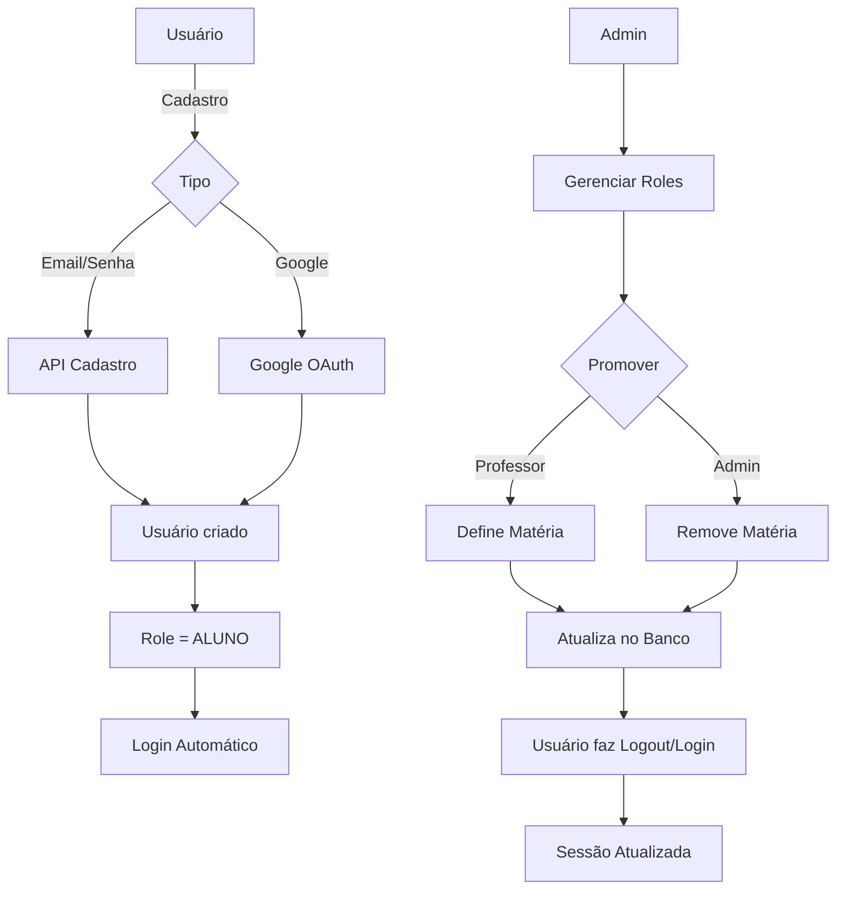

# ✅ IMPLEMENTAÇÃO COMPLETA: Google OAuth + Sistema de Roles

**Data:** 21 de novembro de 2025  
**Status:** ✅ Implementado e Documentado

---

## 📦 **O QUE FOI IMPLEMENTADO**

### ✅ **1. Google OAuth**
- Provider configurado no NextAuth
- Callback que cria usuário automaticamente
- Login social funcional

### ✅ **2. Sistema de Cadastro**
- Formulário funcional com validação
- API `/api/auth/cadastro` criada
- Hash de senha com bcrypt
- Login automático após cadastro

### ✅ **3. Sistema de Roles**
- Role padrão: `ALUNO` para todos os cadastros
- API `/api/admin/gerenciar-roles` para ADMINs
- Página de gerenciamento `/admin/gerenciar-roles`
- Validação: PROFESSOR precisa de matéria

### ✅ **4. Segurança**
- Apenas ADMINs podem alterar roles
- Validação em todas as APIs
- Proteção contra autoprom

oção
- JWT atualiza role automaticamente

### ✅ **5. Documentação**
- `docs/SISTEMA_ROLES_CADASTRO.md` - Guia completo
- `.env.example` atualizado com variáveis do Google
- Script `criar-primeiro-admin.js`

---

## 🚀 **COMO USAR (PASSO A PASSO)**

### **PASSO 1: Configurar Google OAuth** (Opcional)

1. Acesse: https://console.cloud.google.com/
2. Crie projeto ou use existente
3. Vá para **APIs & Services** → **Credentials**
4. Crie **OAuth 2.0 Client ID**
5. Adicione redirect URIs:
   ```
   http://localhost:3000/api/auth/callback/google
   https://seu-dominio.vercel.app/api/auth/callback/google
   ```
6. Copie **Client ID** e **Client Secret**

### **PASSO 2: Configurar Variáveis de Ambiente**

Adicione no `.env.local`:

```bash
# Google OAuth
GOOGLE_CLIENT_ID="seu-client-id.apps.googleusercontent.com"
GOOGLE_CLIENT_SECRET="seu-client-secret"

# NextAuth
NEXTAUTH_URL="http://localhost:3000"
NEXTAUTH_SECRET="gerar-com-openssl-rand-base64-32"
```

### **PASSO 3: Criar Primeiro Admin**

```bash
node scripts/criar-primeiro-admin.js
```

Preencha:
- Nome: Seu nome
- Email: seu-email@gmail.com
- Senha: mínimo 6 caracteres

### **PASSO 4: Testar Fluxos**

#### **A) Cadastro com Email/Senha**
1. Acesse: http://localhost:3000/cadastro
2. Preencha formulário
3. Verifique: criado como ALUNO

#### **B) Cadastro com Google**
1. Acesse: http://localhost:3000/cadastro
2. Clique "Cadastrar com Google"
3. Verifique: criado como ALUNO

#### **C) Promover para Professor**
1. Faça login como ADMIN
2. Acesse: http://localhost:3000/admin/gerenciar-roles
3. Selecione usuário
4. Altere role para PROFESSOR
5. Defina matéria
6. Salve

---

## 📁 **ARQUIVOS CRIADOS/MODIFICADOS**

### **Novos Arquivos:**
```
src/app/api/auth/cadastro/route.ts                 - API de cadastro
src/app/api/admin/gerenciar-roles/route.ts         - API de roles
src/app/admin/gerenciar-roles/page.tsx             - Página de admin
docs/SISTEMA_ROLES_CADASTRO.md                     - Documentação completa
scripts/criar-primeiro-admin.js                    - Script helper
```

### **Arquivos Modificados:**
```
src/lib/auth.ts                                    - Google Provider adicionado
src/app/(auth)/cadastro/page.tsx                   - Integrado com APIs
.env.example                                       - Variáveis do Google
```

---

## 🎯 **FLUXO COMPLETO**



---

## 🔒 **REGRAS DE SEGURANÇA**

### **Cadastro:**
- ✅ Sempre cria como `ALUNO`
- ✅ Email único (não duplica)
- ✅ Senha mínima 6 caracteres
- ✅ Google OAuth: senha vazia

### **Gerenciar Roles:**
- ✅ Apenas `ADMIN` acessa
- ✅ Validação de sessão
- ✅ PROFESSOR → materia obrigatória
- ✅ ALUNO/ADMIN → materia = null

### **JWT/Sessão:**
- ✅ Role atualizado a cada request
- ✅ Logout/Login necessário após promoção
- ✅ Token seguro com NEXTAUTH_SECRET

---

## 🧪 **TESTES**

### **Teste 1: Cadastro Normal**
```bash
# 1. Acesse /cadastro
# 2. Preencha dados
# 3. Verifique role=ALUNO no banco
```

### **Teste 2: Google OAuth**
```bash
# 1. Clique "Cadastrar com Google"
# 2. Faça login no Google
# 3. Verifique role=ALUNO
# 4. Verifique avatar importado
```

### **Teste 3: Promover Role**
```bash
# 1. Login como ADMIN
# 2. Acesse /admin/gerenciar-roles
# 3. Busque usuário
# 4. Altere para PROFESSOR
# 5. Defina matéria
# 6. Salve
# 7. Verifique no banco: role + materia atualizados
```

### **Teste 4: Segurança**
```bash
# 1. Login como ALUNO
# 2. Tente acessar /admin/gerenciar-roles
# 3. Verifique: erro 403 + redirect
```

---

## 📊 **BANCO DE DADOS**

### **Verificar Usuários:**
```sql
SELECT id, nome, email, role, materia 
FROM usuarios 
ORDER BY createdAt DESC;
```

### **Promover Manualmente (Emergência):**
```sql
UPDATE usuarios 
SET role = 'ADMIN' 
WHERE email = 'seu-email@gmail.com';
```

### **Ver Estatísticas:**
```sql
SELECT role, COUNT(*) as total 
FROM usuarios 
GROUP BY role;
```

---

## 🎓 **PRÓXIMOS PASSOS (Opcional)**

### **1. Sistema de Convites**
Enviar email com link único para cadastro direto como PROFESSOR.

### **2. Auditoria**
Tabela `LogRole` para rastrear quem promoveu quem.

### **3. Aprovação de Professores**
Fluxo: Solicitação → Análise → Aprovação/Rejeição

### **4. Limite de Roles**
Definir quota máxima de ADMINs/PROFESSOREs.

---

## ✅ **CHECKLIST FINAL**

### **Desenvolvimento:**
- [x] Google OAuth implementado
- [x] API de cadastro funcional
- [x] API de gerenciar roles funcional
- [x] Página de cadastro integrada
- [x] Página de admin criada
- [x] Validações de segurança
- [x] Documentação completa
- [x] Script de primeiro admin

### **Deploy (Produção):**
- [ ] Configurar Google OAuth no Console
- [ ] Adicionar variáveis na Vercel:
  - [ ] `GOOGLE_CLIENT_ID`
  - [ ] `GOOGLE_CLIENT_SECRET`
  - [ ] `NEXTAUTH_SECRET` (novo)
  - [ ] `NEXTAUTH_URL` (atualizar)
- [ ] Criar primeiro admin no banco de produção
- [ ] Testar login com Google em produção
- [ ] Testar cadastro em produção
- [ ] Testar gerenciamento de roles

---

## 🎉 **CONCLUSÃO**

Sistema completo de cadastro e gerenciamento de roles implementado com:

✅ **Segurança:** Apenas ALUNO no cadastro, ADMINs controlam promoções  
✅ **Conveniência:** Google OAuth funcional  
✅ **Controle:** Página de gerenciamento completa  
✅ **Flexibilidade:** Sistema extensível para futuros recursos  
✅ **Documentação:** Guias detalhados para uso e manutenção  

**Status:** Pronto para uso! 🚀

---

**Perguntas?** Consulte: `docs/SISTEMA_ROLES_CADASTRO.md`
