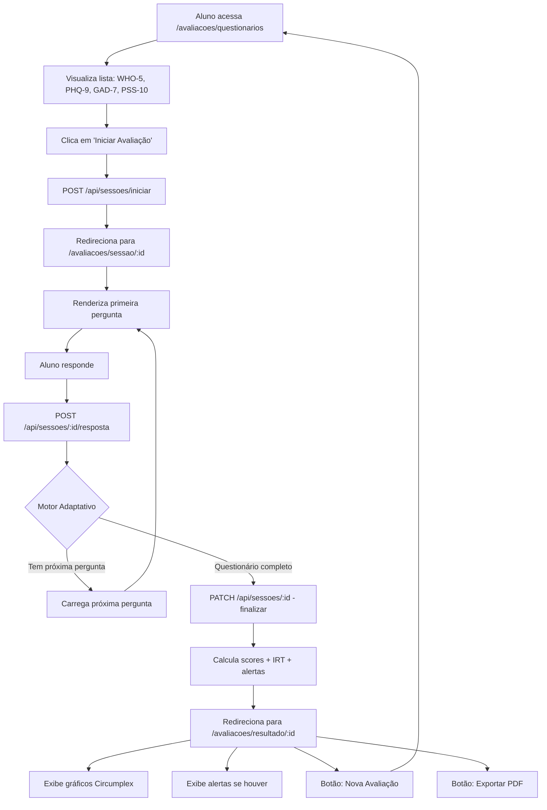
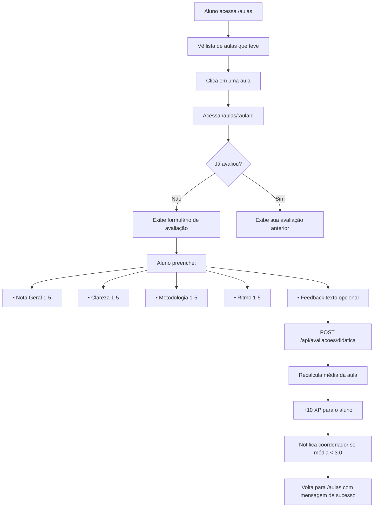
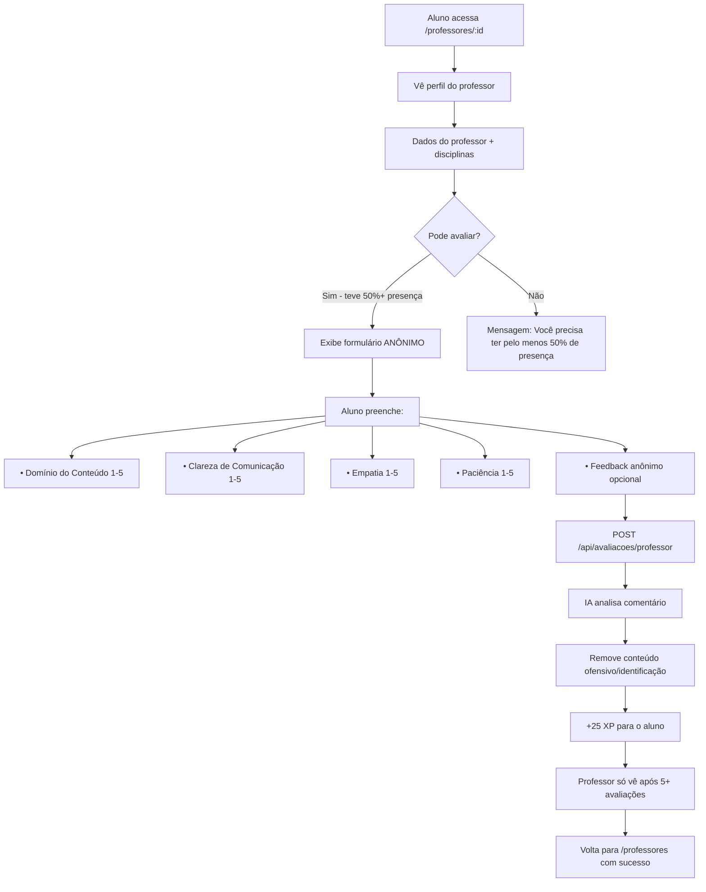
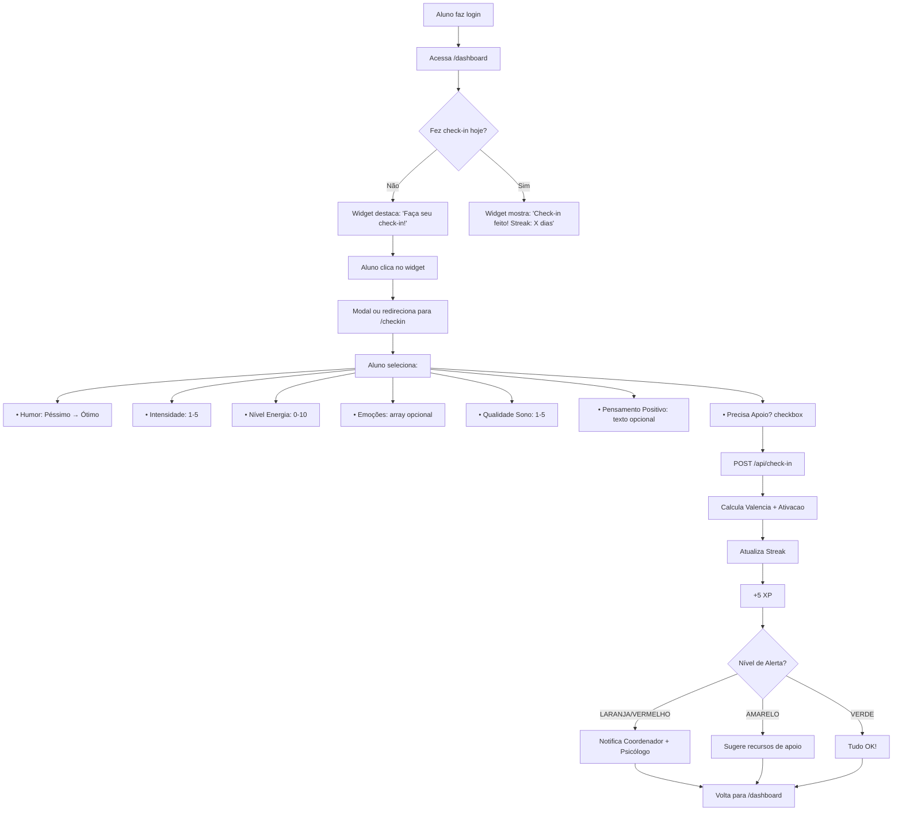

# 🗺️ Mapa Completo de Fluxos - ClassCheck

**Data:** 21 de outubro de 2025  
**Versão:** 2.0  
**Status:** Planejamento Arquitetural

---

## 📊 Visão Geral do Sistema

O ClassCheck possui **3 tipos principais de avaliações**, cada uma com seu próprio fluxo:

```
┌─────────────────────────────────────────────────────────────────┐
│                        CLASSCHECK                                │
├─────────────────────────────────────────────────────────────────┤
│                                                                   │
│  ┌─────────────────┐  ┌─────────────────┐  ┌─────────────────┐ │
│  │   AVALIAÇÕES    │  │   AVALIAÇÕES    │  │   AVALIAÇÕES    │ │
│  │  SOCIOEMOCIONAIS│  │   DIDÁTICAS     │  │   DE CHECK-IN   │ │
│  │    (Você está   │  │  (Aulas/Profs)  │  │    (Diário)     │ │
│  │   criando agora)│  │  (JÁ EXISTEM!)  │  │  (JÁ EXISTE!)   │ │
│  └─────────────────┘  └─────────────────┘  └─────────────────┘ │
│                                                                   │
└─────────────────────────────────────────────────────────────────┘
```

---

## 🎯 1. Avaliações Socioemocionais (Novo - Você está criando)

### 📍 Localização das Páginas
```
/avaliacoes/
  ├── questionarios/              ✅ EXISTE
  │   └── page.tsx               (Lista questionários WHO-5, PHQ-9, etc)
  │
  ├── sessao/[id]/               ✅ EXISTE
  │   └── page.tsx               (Responder perguntas adaptativas)
  │
  └── resultado/[id]/            ❌ FALTA CRIAR
      └── page.tsx               (Resultado final + gráficos)
```

### 🔄 Fluxo Completo



### 🎨 Onde Acessar
```typescript
// Na Sidebar Principal (app-sidebar.tsx) - JÁ EXISTE
{
  title: "Avaliações",
  url: "/avaliacoes/questionarios",
  icon: Brain,
  items: [
    {
      title: "Questionários",
      url: "/avaliacoes/questionarios",
    },
    {
      title: "Meu Histórico",
      url: "/avaliacoes/historico", // ❌ Página futura
    },
    {
      title: "Alertas",
      url: "/avaliacoes/alertas", // ❌ Página futura
    },
  ],
}
```

### 📋 Objetivo
- **Finalidade:** Avaliar saúde mental e bem-estar emocional do aluno
- **Frequência:** Sugerido mensal ou quando aluno sentir necessidade
- **Quem vê:** Aluno, Coordenador, Psicólogo (com permissões)
- **Gera alertas:** Sim (VERDE, AMARELO, LARANJA, VERMELHO)

---

## 📚 2. Avaliações Didáticas (Já existem no sistema!)

### 📍 Localização das Páginas ATUAIS
```
/aulas/                           ✅ JÁ EXISTE
  ├── page.tsx                    (Lista todas as aulas)
  └── [aulaId]/                   ✅ JÁ EXISTE
      └── page.tsx                (Detalhes da aula + formulário de avaliação)

/professores/                     ✅ JÁ EXISTE
  └── [id]/                       
      └── page.tsx                (Perfil do professor + avaliar)
```

### 🔄 Fluxo Atual (JÁ IMPLEMENTADO)



### 🔄 Fluxo de Avaliação de Professor



### 🎨 Onde Acessar (JÁ EXISTE)
```typescript
// Na Sidebar Principal (app-sidebar.tsx)
{
  title: "Aulas",
  url: "/aulas",
  icon: Calendar,
}
{
  title: "Professores",
  url: "/professores",
  icon: Users,
}
```

### 📋 Objetivo
- **Finalidade:** Melhorar qualidade do ensino
- **Frequência:** Após cada aula (janela de 7 dias)
- **Quem vê:** 
  - Avaliação de Aula: Professor, Coordenador
  - Avaliação de Professor: Apenas coordenador (anônima)
- **Gera alertas:** Sim, se média < 3.0

---

## ☀️ 3. Check-in Diário (Já existe no sistema!)

### 📍 Localização das Páginas ATUAIS
```
/dashboard/                       ✅ JÁ EXISTE
  └── page.tsx                    (Dashboard principal com widget de check-in)

/checkin/                         ✅ PODE EXISTIR (verificar)
  └── page.tsx                    (Página dedicada ao check-in)
```

### 🔄 Fluxo Atual (JÁ IMPLEMENTADO)



### 🎨 Onde Acessar (JÁ EXISTE)
```typescript
// Na Sidebar Principal
{
  title: "Dashboard",
  url: "/dashboard",
  icon: Home,
}

// Widget no Dashboard
<CheckInWidget />
```

### 📋 Objetivo
- **Finalidade:** Monitorar bem-estar emocional diário
- **Frequência:** 1x por dia (máximo)
- **Quem vê:** Aluno, Coordenador (se alerta), Psicólogo (se alerta)
- **Gera alertas:** Sim (baseado em padrões temporais)

---

## 🔗 Integração Entre os 3 Sistemas

### Como eles se relacionam?

```
┌─────────────────────────────────────────────────────────────────┐
│                   DASHBOARD UNIFICADO                            │
├─────────────────────────────────────────────────────────────────┤
│                                                                   │
│  ┌───────────────────────────────────────────────────────────┐  │
│  │  CHECK-IN DIÁRIO (Monitoramento Rápido)                   │  │
│  │  - Humor hoje: 😊                                          │  │
│  │  - Streak: 12 dias                                         │  │
│  │  - Alerta: VERDE ✅                                        │  │
│  └───────────────────────────────────────────────────────────┘  │
│                                                                   │
│  ┌───────────────────────────────────────────────────────────┐  │
│  │  AVALIAÇÃO SOCIOEMOCIONAL (Profunda - Mensal)             │  │
│  │  - Última: 15 dias atrás                                   │  │
│  │  - Sugestão: Faça nova avaliação WHO-5                    │  │
│  │  - Score último: Bem-estar Moderado (60%)                 │  │
│  └───────────────────────────────────────────────────────────┘  │
│                                                                   │
│  ┌───────────────────────────────────────────────────────────┐  │
│  │  AULAS PENDENTES DE AVALIAÇÃO                              │  │
│  │  - 3 aulas aguardando sua avaliação                        │  │
│  │  - Última aula avaliada: Cálculo II (4.5⭐)               │  │
│  │  - +10 XP disponível!                                      │  │
│  └───────────────────────────────────────────────────────────┘  │
│                                                                   │
└─────────────────────────────────────────────────────────────────┘
```

### 🚨 Sistema de Alertas Unificado

```typescript
// Todos os 3 sistemas alimentam o mesmo sistema de alertas

enum OrigemAlerta {
  CHECK_IN = "Check-in Diário",
  QUESTIONARIO = "Avaliação Socioemocional",
  PRESENCA = "Frequência em Aulas",
  DESEMPENHO = "Notas/Desempenho Acadêmico",
}

// Exemplo: Correlação entre sistemas
if (
  checkIn.humor <= 2 por 5 dias consecutivos &&
  questionarioRecente.scoreDepressao >= 10 &&
  presencaUltimaSemana < 50%
) {
  criarAlerta({
    nivel: "VERMELHO",
    tipo: "RISCO_MULTIPLO",
    mensagem: "Múltiplos indicadores de risco detectados",
    origens: [CHECK_IN, QUESTIONARIO, PRESENCA],
    acoes: [
      "NOTIFICAR_COORDENADOR",
      "NOTIFICAR_PSICOLOGO",
      "OFERECER_APOIO_IMEDIATO",
    ],
  });
}
```

---

## 📱 Estrutura de Navegação Recomendada

### Sidebar Atual (app-sidebar.tsx)

```typescript
const menuItems = [
  // ===== SEÇÃO: PRINCIPAL =====
  {
    title: "Dashboard",
    url: "/dashboard",
    icon: Home,
    badge: checkInPendente ? "!" : null,
  },
  
  // ===== SEÇÃO: AVALIAÇÕES =====
  {
    title: "Avaliações",
    icon: Brain,
    items: [
      {
        title: "Check-in Diário",
        url: "/checkin",
        icon: Heart,
        badge: checkInPendente ? "Fazer agora" : null,
      },
      {
        title: "Questionários",
        url: "/avaliacoes/questionarios",
        icon: FileQuestion,
        badge: sugestaoQuestionario ? "Novo" : null,
      },
      {
        title: "Meu Histórico",
        url: "/avaliacoes/historico",
        icon: History,
      },
      {
        title: "Alertas",
        url: "/avaliacoes/alertas",
        icon: AlertTriangle,
        badge: alertasAtivos > 0 ? alertasAtivos : null,
      },
    ],
  },
  
  // ===== SEÇÃO: ACADÊMICO =====
  {
    title: "Aulas",
    url: "/aulas",
    icon: Calendar,
    badge: aulasParaAvaliar > 0 ? `${aulasParaAvaliar} pendentes` : null,
  },
  {
    title: "Professores",
    url: "/professores",
    icon: Users,
  },
  {
    title: "Turmas",
    url: "/turmas",
    icon: GraduationCap,
  },
  
  // ===== SEÇÃO: GAMIFICAÇÃO =====
  {
    title: "Conquistas",
    url: "/conquistas",
    icon: Trophy,
    badge: novasConquistas > 0 ? "Novo!" : null,
  },
  {
    title: "Ranking",
    url: "/ranking",
    icon: Crown,
  },
  
  // ===== SEÇÃO: CONTA =====
  {
    title: "Perfil",
    url: "/perfil",
    icon: User,
  },
  {
    title: "Configurações",
    url: "/configuracoes",
    icon: Settings,
  },
];
```

---

## 🎯 Resumo: O que você está criando vs O que já existe

### ✅ JÁ EXISTE NO SISTEMA
1. **Check-in Diário** (`/dashboard`, `/checkin`)
   - Widget no dashboard
   - Humor, energia, sono
   - Streak de dias consecutivos
   - Alertas por padrões temporais

2. **Avaliações Didáticas** (`/aulas/[id]`)
   - Avaliar aulas após acontecerem
   - Notas: clareza, metodologia, ritmo
   - Feedback opcional
   - +10 XP por avaliação

3. **Avaliações de Professores** (`/professores/[id]`)
   - Avaliação anônima
   - Domínio, comunicação, empatia
   - Requer 50%+ presença
   - +25 XP por avaliação

### 🚧 VOCÊ ESTÁ CRIANDO AGORA
4. **Avaliações Socioemocionais** (`/avaliacoes/*`)
   - ✅ `/avaliacoes/questionarios` - Lista questionários científicos
   - ✅ `/avaliacoes/sessao/[id]` - Responder perguntas adaptativas
   - ❌ `/avaliacoes/resultado/[id]` - **FALTA CRIAR** - Resultado + gráficos
   - ❌ `/avaliacoes/historico` - **FALTA CRIAR** - Histórico de avaliações
   - ❌ `/avaliacoes/alertas` - **FALTA CRIAR** - Central de alertas

---

## 🗺️ Roadmap de Desenvolvimento

### Fase Atual: Avaliações Socioemocionais
```
[████████████████░░░░] 80% Completo

✅ Backend (API routes)
✅ Banco de dados (Prisma schema)
✅ Motor adaptativo (IRT + rules engine)
✅ Página de questionários
✅ Página de sessão
❌ Página de resultado
❌ Página de histórico
❌ Página de alertas
```

### Próximas Fases
1. **Fase 1:** Finalizar `/avaliacoes/resultado/[id]` ← **VOCÊ ESTÁ AQUI**
2. **Fase 2:** Criar `/avaliacoes/historico` (lista todas as avaliações do aluno)
3. **Fase 3:** Criar `/avaliacoes/alertas` (central de alertas socioemocionais)
4. **Fase 4:** Integrar tudo no dashboard principal
5. **Fase 5:** Adicionar notificações push/email
6. **Fase 6:** Criar dashboard do coordenador/psicólogo

---

## 🎨 Mockup da Página de Resultado (Próximo a criar)

```
┌─────────────────────────────────────────────────────────────────┐
│  ← Voltar    RESULTADO DA AVALIAÇÃO                    🔄 🖨️ 📤   │
├─────────────────────────────────────────────────────────────────┤
│                                                                   │
│  ┌─────────────────────────────────────────────────────────┐    │
│  │  PHQ-9 - Avaliação de Depressão                         │    │
│  │  Finalizada em: 21/10/2025 às 15:30                     │    │
│  │  Tempo total: 3min 45s                                   │    │
│  └─────────────────────────────────────────────────────────┘    │
│                                                                   │
│  ┌──────────────────────┐  ┌──────────────────────────────────┐ │
│  │   SCORE TOTAL        │  │   NÍVEL DE ALERTA                │ │
│  │                      │  │                                  │ │
│  │      12 / 27         │  │   🟠 LARANJA (Moderado)         │ │
│  │   Moderado           │  │                                  │ │
│  └──────────────────────┘  └──────────────────────────────────┘ │
│                                                                   │
│  ┌─────────────────────────────────────────────────────────┐    │
│  │  GRÁFICO CIRCUMPLEX (Russell's Model)                   │    │
│  │                                                          │    │
│  │           Ativação Alta                                  │    │
│  │               ↑                                          │    │
│  │  Ansioso  •     •  Animado                              │    │
│  │               ●  ← Você está aqui                        │    │
│  │  Valência ←───┼───→ Valência                            │    │
│  │   Negativa    │    Positiva                             │    │
│  │               ↓                                          │    │
│  │           Ativação Baixa                                 │    │
│  └─────────────────────────────────────────────────────────┘    │
│                                                                   │
│  ┌─────────────────────────────────────────────────────────┐    │
│  │  SCORES POR CATEGORIA                                   │    │
│  │                                                          │    │
│  │  Humor Deprimido         ████████░░  8/10               │    │
│  │  Perda de Interesse      ██████░░░░  6/10               │    │
│  │  Sono                    █████░░░░░  5/10               │    │
│  │  Energia                 ████░░░░░░  4/10               │    │
│  │  Concentração            ███████░░░  7/10               │    │
│  │  Autoestima              ██████░░░░  6/10               │    │
│  └─────────────────────────────────────────────────────────┘    │
│                                                                   │
│  ┌─────────────────────────────────────────────────────────┐    │
│  │  RECOMENDAÇÕES                                          │    │
│  │                                                          │    │
│  │  Com base nos seus resultados, sugerimos:               │    │
│  │                                                          │    │
│  │  ✓ Conversar com coordenador pedagógico                 │    │
│  │  ✓ Agendar sessão com psicólogo da instituição          │    │
│  │  ✓ Praticar técnicas de relaxamento (link)              │    │
│  │  ✓ Manter rotina de sono regular                        │    │
│  │  ✓ CVV - Discar 188 (emergência)                        │    │
│  └─────────────────────────────────────────────────────────┘    │
│                                                                   │
│  ┌─────────────────────────────────────────────────────────┐    │
│  │  HISTÓRICO DE RESPOSTAS                                 │    │
│  │                                                          │    │
│  │  1. Pouco interesse ou prazer?  → Vários dias (2 pts)   │    │
│  │  2. Sentindo-se para baixo?     → Mais da metade (3)    │    │
│  │  3. Problemas para dormir?      → Vários dias (2 pts)   │    │
│  │  ... (mostrar todas as 9)                               │    │
│  └─────────────────────────────────────────────────────────┘    │
│                                                                   │
│  ┌─────────────────────────────────────────────────────────┐    │
│  │  ALGORITMO IRT (Item Response Theory)                   │    │
│  │                                                          │    │
│  │  Theta (θ): -0.45  (Habilidade estimada)               │    │
│  │  Erro padrão: 0.32                                      │    │
│  │  Confiança: 89%                                         │    │
│  │                                                          │    │
│  │  [Ver detalhes técnicos]                                │    │
│  └─────────────────────────────────────────────────────────┘    │
│                                                                   │
│  ┌──────────────────┐  ┌──────────────────┐  ┌──────────────┐  │
│  │ 📄 Exportar PDF  │  │ 🔄 Nova Avaliação │  │ 📊 Histórico │  │
│  └──────────────────┘  └──────────────────┘  └──────────────┘  │
│                                                                   │
└─────────────────────────────────────────────────────────────────┘
```

---

## 📝 Conclusão

### Respondendo sua pergunta:

**"Como vai funcionar depois? Eu vou fazer as avaliações das aulas por onde?"**

**Resposta:** As avaliações de aulas **já existem** no sistema! Você as faz em:
- **`/aulas`** → Clica em uma aula → Preenche formulário de avaliação didática
- **`/professores/:id`** → Clica em um professor → Preenche avaliação anônima

**O que você está criando agora (`/avaliacoes/*`) é um sistema DIFERENTE:**
- Avaliações **socioemocionais** (saúde mental, bem-estar)
- Questionários científicos (WHO-5, PHQ-9)
- Motor adaptativo com IRT
- Gera alertas para coordenador/psicólogo

### Os 3 sistemas são INDEPENDENTES mas se COMPLEMENTAM:

```
ALUNO FAZ CHECK-IN DIÁRIO
    ↓
SE HUMOR RUIM POR 5+ DIAS
    ↓
SISTEMA SUGERE: "Faça uma avaliação WHO-5"
    ↓
ALUNO VAI EM /avaliacoes/questionarios
    ↓
COMPLETA QUESTIONÁRIO
    ↓
RESULTADO GERA ALERTA LARANJA
    ↓
COORDENADOR É NOTIFICADO
    ↓
COORDENADOR OFERECE APOIO
```

### Ordem de Criação das Páginas Faltantes:

1. ✅ **FEITO:** `/avaliacoes/questionarios` (lista questionários)
2. ✅ **FEITO:** `/avaliacoes/sessao/[id]` (responder perguntas)
3. ❌ **PRÓXIMO:** `/avaliacoes/resultado/[id]` ← **CRIAR AGORA**
4. ❌ **DEPOIS:** `/avaliacoes/historico` (lista todas as avaliações feitas)
5. ❌ **DEPOIS:** `/avaliacoes/alertas` (central de alertas)
6. ❌ **FUTURO:** Dashboard do coordenador/psicólogo

---

**Está mais claro agora? Quer que eu crie a página `/avaliacoes/resultado/[id]` para finalizar o fluxo?** 🚀
