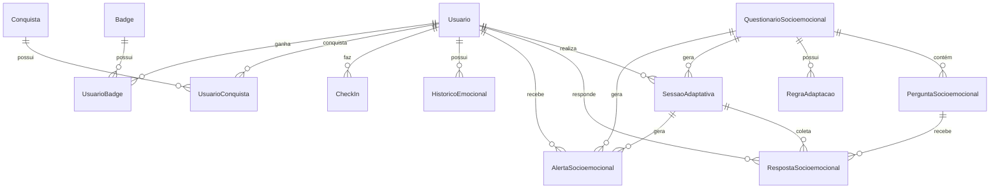

# 🗄️ Planejamento do Banco de Dados - Sistema Adaptativo ClassCheck

**Data:** 16 de outubro de 2025  
**Versão:** 1.0  
**Stack:** PostgreSQL + Prisma + json-rules-engine  
**Status:** ✅ Schema Completo

---

## 📋 Índice

1. [Visão Geral](#visão-geral)
2. [Arquitetura do Banco de Dados](#arquitetura-do-banco-de-dados)
3. [Modelos Implementados](#modelos-implementados)
4. [Relacionamentos Principais](#relacionamentos-principais)
5. [Índices e Otimizações](#índices-e-otimizações)
6. [Próximos Passos](#próximos-passos)

---

## 🎯 Visão Geral

### Objetivo

Implementar um **sistema de questionários adaptativos** completo para o ClassCheck, utilizando:

- ✅ **PostgreSQL** - Banco de dados relacional robusto
- ✅ **Prisma ORM** - Type-safe database access
- ✅ **json-rules-engine** - Motor de regras adaptativas
- ✅ **IRT** - Item Response Theory para adaptação inteligente
- ✅ **Modelo Circumplex** - Análise emocional bidimensional (valencia + ativação)

### Características Principais

```
┌─────────────────────────────────────────────────────────┐
│         Sistema de Questionários Adaptativos            │
├─────────────────────────────────────────────────────────┤
│                                                           │
│  1. Banco de Perguntas Validadas                        │
│     • Escalas psicométricas (WHO-5, PHQ-9, GAD-7)      │
│     • Perguntas customizadas                            │
│     • Metadados IRT (dificuldade, discriminação)        │
│                                                           │
│  2. Motor de Regras (json-rules-engine)                 │
│     • 12 tipos de condições                             │
│     • 8 tipos de ações                                   │
│     • Adaptação em tempo real                           │
│                                                           │
│  3. Sessões Adaptativas                                 │
│     • Rastreamento de progresso                         │
│     • Estimativa IRT (theta)                            │
│     • Alertas em tempo real                             │
│                                                           │
│  4. Sistema de Alertas Multinível                       │
│     • VERDE: Tudo OK                                    │
│     • AMARELO: Atenção                                  │
│     • LARANJA: Preocupação moderada                     │
│     • VERMELHO: Intervenção urgente                     │
│                                                           │
│  5. Gamificação                                          │
│     • XP e níveis                                       │
│     • Conquistas e badges                               │
│     • Streaks de check-ins                              │
│                                                           │
│  6. Histórico e Analytics                                │
│     • Evolução temporal (dia/semana/mês)                │
│     • Tendências emocionais                             │
│     • Comparação com média                              │
│                                                           │
└─────────────────────────────────────────────────────────┘
```

---

## 🏗️ Arquitetura do Banco de Dados

### Organização em Módulos

O banco de dados foi organizado em **6 módulos principais**:

#### 1. Módulo Core (Existente)
- `Usuario` - Usuários do sistema
- `Professor` - Professores
- `Aula` - Aulas agendadas
- `Avaliacao` - Avaliações de aulas
- `Evento` - Calendário

#### 2. Módulo de Avaliações Reestruturado
- `AvaliacaoSocioemocional` - Questionários adaptativos (Modelo Circumplex)
- `AvaliacaoDidatica` - Avaliação pedagógica
- `AvaliacaoProfessor` - Avaliação periódica de professores

#### 3. Módulo de Questionários Adaptativos (NOVO) ⭐
- `QuestionarioSocioemocional` - Template de questionários
- `PerguntaSocioemocional` - Banco de perguntas
- `BancoPerguntasAdaptativo` - Perguntas dinâmicas (IRT)
- `RegraAdaptacao` - Motor de regras (json-rules-engine)
- `SessaoAdaptativa` - Sessões em tempo real
- `RespostaSocioemocional` - Respostas dos usuários

#### 4. Módulo de Alertas e Monitoramento (NOVO) ⭐
- `AlertaSocioemocional` - Sistema de alertas multinível
- `HistoricoEmocional` - Evolução temporal agregada

#### 5. Módulo de Gamificação (NOVO) ⭐
- `Conquista` - Achievements do sistema
- `UsuarioConquista` - Conquistas dos usuários
- `Badge` - Distintivos
- `UsuarioBadge` - Badges dos usuários
- `CheckIn` - Check-ins diários

#### 6. Módulo de Sistema (NOVO) ⭐
- `Notificacao` - Notificações e lembretes
- `LogAtividade` - Logs e auditoria

---

## 📊 Modelos Implementados

### 3.1 QuestionarioSocioemocional

**Propósito:** Template de questionário (ex: "Check-in Diário", "Avaliação Mensal")

```prisma
model QuestionarioSocioemocional {
  id              String   @id @default(uuid())
  titulo          String
  tipo            TipoQuestionario
  adaptativo      Boolean  @default(false)
  nivelAdaptacao  NivelAdaptacao?
  categorias      String[]
  ativo           Boolean  @default(true)
  oficial         Boolean  @default(false)
  
  // Relacionamentos
  perguntas       PerguntaSocioemocional[]
  sessoes         SessaoAdaptativa[]
  alertas         AlertaSocioemocional[]
  regras          RegraAdaptacao[]
}
```

**Tipos de Questionário:**
- `CHECK_IN_DIARIO` - Check-in rápido (3-5 perguntas)
- `AVALIACAO_SEMANAL` - Avaliação semanal (8-12 perguntas)
- `AVALIACAO_POS_AULA` - Após cada aula
- `AVALIACAO_CRITICA` - Momento de crise
- `QUESTIONARIO_INICIAL` - Onboarding

**Níveis de Adaptação:**
- `BAIXO` - Skip logic básico
- `MEDIO` - Regras condicionais simples
- `ALTO` - Regras complexas + banco de perguntas
- `MUITO_ALTO` - IRT + Machine Learning

---

### 3.2 PerguntaSocioemocional

**Propósito:** Banco de perguntas com metadados IRT

```prisma
model PerguntaSocioemocional {
  id              String   @id @default(uuid())
  questionarioId  String
  texto           String
  categoria       CategoriaPergunta
  dominio         DominioEmocional
  tipoPergunta    TipoPergunta
  ordem           Int
  
  // Metadados IRT
  dificuldade     Float    @default(0.5)
  discriminacao   Float    @default(1.0)
  peso            Float    @default(1.0)
  
  // Escala de referência
  escalaNome      String?  // "WHO-5", "PHQ-9", "GAD-7"
  escalaItem      String?
  
  // Tags para busca
  tags            String[]
  palavrasChave   String[]
  
  opcoes          Json?    // Opções de resposta
  ativo           Boolean  @default(true)
  validada        Boolean  @default(false)
}
```

**Categorias de Pergunta (18 tipos):**
- Humor Geral
- Ansiedade
- Depressão
- Estresse
- Sono
- Concentração
- Motivação
- Relacionamentos
- Autoestima
- Energia
- Fadiga
- Irritabilidade
- Pensamentos Negativos
- Apoio Social
- Desempenho Acadêmico
- Satisfação com a Vida
- Bem-estar
- Saúde Física

**Tipos de Pergunta (15 tipos):**
- `LIKERT_5`, `LIKERT_7`, `LIKERT_10`
- `ESCALA_VISUAL` (slider)
- `MULTIPLA_ESCOLHA`, `MULTIPLA_SELECAO`
- `TEXTO_CURTO`, `TEXTO_LONGO`
- `SIM_NAO`
- `EMOJI_PICKER`
- `ESCALA_FREQUENCIA` ("Nunca" → "Sempre")
- `ESCALA_INTENSIDADE` ("Nada" → "Extremamente")
- `RANKING` (ordenar opções)

---

### 3.3 BancoPerguntasAdaptativo

**Propósito:** Perguntas dinâmicas com metadados IRT completos

```prisma
model BancoPerguntasAdaptativo {
  id              String   @id @default(uuid())
  codigo          String   @unique // "GAD7_001"
  texto           String
  categoria       CategoriaPergunta
  dominio         DominioEmocional
  tipoPergunta    TipoPergunta
  
  // IRT - Item Response Theory
  parametroA      Float    @default(1.0) // Discriminação
  parametroB      Float    @default(0.0) // Dificuldade
  parametroC      Float    @default(0.0) // Chute
  
  // Escala
  escalaNome      String?
  escalaItem      String?
  
  // Condições de uso
  condicoes       Json?
  
  // Estatísticas
  vezesUsada      Int      @default(0)
  taxaResposta    Float?
  tempoMedioResposta Int?
  
  ativo           Boolean  @default(true)
  validada        Boolean  @default(false)
}
```

**Parâmetros IRT:**
- **Discriminação (a):** Quão bem a pergunta diferencia pessoas com diferentes níveis do traço
- **Dificuldade (b):** Nível do traço necessário para 50% de probabilidade de "acertar"
- **Chute (c):** Probabilidade de resposta correta ao acaso (para múltipla escolha)

---

### 3.4 RegraAdaptacao

**Propósito:** Motor de regras compatível com json-rules-engine

```prisma
model RegraAdaptacao {
  id              String   @id @default(uuid())
  questionarioId  String
  nome            String
  prioridade      Int      @default(0)
  
  // JSON compatível com json-rules-engine
  condicoes       Json
  acoes           Json
  
  tipoCondicao    TipoCondicao
  tipoAcao        TipoAcao[]
  eventoGatilho   EventoGatilho?
  
  ativo           Boolean  @default(true)
  vezesAcionada   Int      @default(0)
  ultimoAcionamento DateTime?
}
```

**Exemplo de Condição:**
```json
{
  "all": [
    {
      "fact": "ansiedade",
      "operator": "greaterThan",
      "value": 7
    },
    {
      "fact": "sono",
      "operator": "lessThan",
      "value": 3
    }
  ]
}
```

**Exemplo de Ação:**
```json
[
  {
    "type": "BUSCAR_BANCO",
    "params": {
      "dominio": "ANSIEDADE",
      "escala": "GAD-7",
      "quantidade": 3
    }
  },
  {
    "type": "CRIAR_ALERTA",
    "params": {
      "nivel": "LARANJA",
      "tipo": "RISCO_MODERADO"
    }
  }
]
```

**Tipos de Condição (12):**
- `VALOR_EXATO`, `VALOR_DIFERENTE`
- `MAIOR_QUE`, `MENOR_QUE`, `MAIOR_OU_IGUAL`, `MENOR_OU_IGUAL`
- `RANGE_NUMERICO`
- `CONTEM_TEXTO`
- `MULTIPLAS_RESPOSTAS`
- `PADRAO_TEMPORAL`
- `DESVIO_PADRAO`
- `TENDENCIA`

**Tipos de Ação (8):**
- `INSERIR_PERGUNTA` - Adiciona pergunta específica
- `PULAR_SECAO` - Pula próxima seção
- `FINALIZAR_QUESTIONARIO` - Encerra
- `BUSCAR_BANCO` - Busca no banco adaptativo
- `CRIAR_ALERTA` - Gera alerta
- `NOTIFICAR_PROFISSIONAL` - Envia notificação
- `ALTERAR_FLUXO` - Muda sequência
- `RECOMENDAR_RECURSO` - Sugere recurso de apoio

---

### 3.5 SessaoAdaptativa

**Propósito:** Rastrear sessão de resposta em tempo real

```prisma
model SessaoAdaptativa {
  id              String   @id @default(uuid())
  usuarioId       Int
  questionarioId  String
  status          StatusSessao @default(EM_ANDAMENTO)
  progresso       Float    @default(0.0)
  
  // Estado da sessão
  perguntasApresentadas String[]
  perguntasRespondidas  String[]
  perguntaAtual   String?
  proximaPergunta String?
  
  // IRT
  thetaEstimado   Float?   // Nível do traço latente
  erroEstimacao   Float?
  confianca       Float?
  
  // Alertas
  nivelAlerta     NivelAlerta @default(VERDE)
  alertasGerados  String[]
  
  // Tempo
  iniciadoEm      DateTime @default(now())
  finalizadoEm    DateTime?
  tempoTotalSegundos Int?
  
  // Relacionamentos
  usuario         Usuario
  questionario    QuestionarioSocioemocional
  respostas       RespostaSocioemocional[]
  alertas         AlertaSocioemocional[]
}
```

**Estados da Sessão:**
- `EM_ANDAMENTO` - Usuário respondendo
- `PAUSADA` - Temporariamente pausada
- `FINALIZADA` - Completa
- `CANCELADA` - Cancelada pelo usuário
- `EXPIRADA` - Tempo expirado

---

### 3.6 RespostaSocioemocional

**Propósito:** Armazenar cada resposta com metadados

```prisma
model RespostaSocioemocional {
  id              String   @id @default(uuid())
  sessaoId        String
  perguntaId      String
  usuarioId       Int
  
  // Resposta
  valor           Json
  valorNormalizado Float?
  
  // Metadados
  tempoResposta   Int
  tentativas      Int      @default(1)
  alterada        Boolean  @default(false)
  
  // Análise Circumplex
  valencia        Float?   // -1.0 a 1.0
  ativacao        Float?   // -1.0 a 1.0
  
  // IRT
  thetaAposResposta Float?
  contribuicaoInfo  Float?
  
  timestamp       DateTime @default(now())
  ordem           Int
}
```

**Modelo Circumplex (Russell):**
- **Valencia:** Dimensão negativo ↔ positivo
- **Ativação:** Dimensão baixa energia ↔ alta energia

```
     Alta Ativação (+1.0)
            ↑
            │
   ANSIOSO  │  ANIMADO
   NERVOSO  │  ENTUSIASMADO
────────────┼────────────→ Valencia
 Negativo   │   Positivo
  (-1.0)    │    (+1.0)
   TRISTE   │  CALMO
  DEPRIMIDO │  SERENO
            │
            ↓
    Baixa Ativação (-1.0)
```

---

### 3.7 AlertaSocioemocional

**Propósito:** Sistema de alertas multinível

```prisma
model AlertaSocioemocional {
  id              String   @id @default(uuid())
  usuarioId       Int
  sessaoId        String?
  questionarioId  String
  
  // Classificação
  nivel           NivelAlerta
  tipo            TipoAlerta
  categoria       CategoriaPergunta
  dominio         DominioEmocional?
  
  // Conteúdo
  titulo          String
  descricao       String
  recomendacoes   Json?
  
  // Dados que geraram
  dadosContexto   Json
  regrasAcionadas String[]
  
  // Pontuações
  scoreTotal      Float?
  scoreDominio    Float?
  desvioMedia     Float?
  
  // Status
  status          StatusAlerta @default(PENDENTE)
  lido            Boolean  @default(false)
  notificado      Boolean  @default(false)
  
  // Ações tomadas
  acao            String?
  observacoes     String?
  resolvidoEm     DateTime?
  resolvidoPor    Int?
}
```

**Níveis de Alerta:**

| Nível | Cor | Descrição | Ação |
|-------|-----|-----------|------|
| **VERDE** | 🟢 | Tudo OK | Nenhuma ação necessária |
| **AMARELO** | 🟡 | Atenção leve | Monitorar próximos dias |
| **LARANJA** | 🟠 | Preocupação moderada | Notificar coordenador |
| **VERMELHO** | 🔴 | Urgente | Intervenção imediata |

**Tipos de Alerta:**
- `RISCO_BAIXO`
- `RISCO_MODERADO`
- `RISCO_ALTO`
- `CRISE_IMEDIATA`
- `PADRAO_PREOCUPANTE`
- `MELHORA_SIGNIFICATIVA`
- `ESTAVEL`

---

### 3.8 HistoricoEmocional

**Propósito:** Agregações temporais para análise de tendências

```prisma
model HistoricoEmocional {
  id              String   @id @default(uuid())
  usuarioId       Int
  data            DateTime
  periodo         PeriodoHistorico // DIA, SEMANA, MES
  
  // Modelo Circumplex
  valenciaMedia   Float
  ativacaoMedia   Float
  estadoDominante String
  
  // Scores por domínio (0-10)
  scoreHumor      Float?
  scoreAnsiedade  Float?
  scoreEstresse   Float?
  scoreMotivacao  Float?
  scoreSono       Float?
  scoreRelacionamentos Float?
  scoreAutoestima Float?
  
  // Estatísticas
  totalAvaliacoes Int
  taxaResposta    Float?
  
  // Tendências
  tendenciaValencia String? // CRESCENTE, ESTAVEL, DECRESCENTE
  tendenciaAtivacao String?
  
  // Alertas
  totalAlertas    Int
  alertasVermelhos Int
  alertasLaranjas Int
  alertasAmarelos Int
  
  // Comparação
  desvioValencia  Float?
  desvioAtivacao  Float?
}
```

**Períodos de Agregação:**
- `DIA` - Agregação diária
- `SEMANA` - Semanal (domingo a sábado)
- `MES` - Mensal
- `TRIMESTRE` - Trimestral
- `SEMESTRE` - Semestral
- `ANO` - Anual

---

### 3.9 Sistema de Gamificação

#### Conquista
```prisma
model Conquista {
  id              String   @id @default(uuid())
  codigo          String   @unique
  titulo          String
  descricao       String
  categoria       CategoriaConquista
  xp              Int
  icone           String
  raridade        Raridade
  criterios       Json
  ativo           Boolean  @default(true)
  oculta          Boolean  @default(false)
}
```

**Categorias:**
- `ENGAJAMENTO` - Check-ins, respostas
- `CONSISTENCIA` - Streaks, regularidade
- `PROGRESSO` - Melhoras no bem-estar
- `SOCIAL` - Interações
- `APRENDIZADO` - Completar tutoriais
- `ESPECIAL` - Eventos especiais
- `SECRETA` - Conquistas ocultas

**Raridades:**
- `COMUM` (1 estrela) - XP: 10-50
- `INCOMUM` (2 estrelas) - XP: 50-100
- `RARO` (3 estrelas) - XP: 100-250
- `EPICO` (4 estrelas) - XP: 250-500
- `LENDARIO` (5 estrelas) - XP: 500+

#### Badge
```prisma
model Badge {
  id              String   @id @default(uuid())
  codigo          String   @unique
  titulo          String
  descricao       String
  icone           String
  tipo            TipoBadge
  categoria       CategoriaBadge
  criterios       Json
  ativo           Boolean  @default(true)
}
```

**Tipos:**
- `PERMANENTE` - Nunca expira
- `TEMPORARIO` - Tempo limitado
- `PROGRESSIVO` - Com níveis (Bronze → Prata → Ouro)
- `SAZONAL` - Eventos especiais

#### CheckIn
```prisma
model CheckIn {
  id              String   @id @default(uuid())
  usuarioId       Int
  data            DateTime @default(now())
  hora            String
  humor           Int      // 0-10
  emoji           String?
  observacao      String?
  atividades      String[]
  xpGanho         Int      @default(10)
  streak          Int      @default(1)
}
```

---

## 🔗 Relacionamentos Principais

### Diagrama ER Simplificado



### Cardinalidades

| Relacionamento | Tipo | Descrição |
|----------------|------|-----------|
| Usuario → SessaoAdaptativa | 1:N | Usuário tem várias sessões |
| SessaoAdaptativa → RespostaSocioemocional | 1:N | Sessão tem várias respostas |
| QuestionarioSocioemocional → PerguntaSocioemocional | 1:N | Questionário tem várias perguntas |
| QuestionarioSocioemocional → RegraAdaptacao | 1:N | Questionário tem várias regras |
| Usuario → AlertaSocioemocional | 1:N | Usuário recebe vários alertas |
| Usuario → UsuarioConquista | N:M | Usuário pode ter várias conquistas |
| Usuario → UsuarioBadge | N:M | Usuário pode ter vários badges |

---

## ⚡ Índices e Otimizações

### Índices Implementados

```prisma
// QuestionarioSocioemocional
@@index([tipo, ativo])
@@index([publicado, ativo])

// PerguntaSocioemocional
@@index([categoria, ativo])
@@index([dominio, ativo])
@@index([escalaNome])
@@index([questionarioId, ordem])

// BancoPerguntasAdaptativo
@@index([categoria, dominio, ativo])
@@index([escalaNome])
@@index([codigo])

// RegraAdaptacao
@@index([questionarioId, ativo, prioridade])
@@index([tipoCondicao, tipoAcao])

// SessaoAdaptativa
@@index([usuarioId, status])
@@index([questionarioId, status])
@@index([nivelAlerta])

// RespostaSocioemocional
@@index([sessaoId, ordem])
@@index([usuarioId, timestamp])
@@index([perguntaId])

// AlertaSocioemocional
@@index([usuarioId, nivel, status])
@@index([nivel, status, criadoEm])
@@index([categoria, nivel])

// HistoricoEmocional
@@index([usuarioId, periodo, data])

// CheckIn
@@index([usuarioId, data])

// Notificacao
@@index([usuarioId, lida, criadoEm])
@@index([tipo, enviada])

// LogAtividade
@@index([usuarioId, tipo, criadoEm])
@@index([tipo, criadoEm])
```

### Estratégias de Otimização

#### 1. Particionamento (Futuro)

Para tabelas de alto volume:

```sql
-- HistoricoEmocional particionado por mês
CREATE TABLE historico_emocional_2025_10 PARTITION OF historico_emocional
FOR VALUES FROM ('2025-10-01') TO ('2025-11-01');

-- RespostaSocioemocional particionado por trimestre
CREATE TABLE respostas_socioemocionais_2025_q4 PARTITION OF respostas_socioemocionais
FOR VALUES FROM ('2025-10-01') TO ('2026-01-01');
```

#### 2. Índices Compostos

```sql
-- Consultas frequentes de alertas
CREATE INDEX idx_alertas_usuario_nivel_status ON alertas_socioemocionais(usuario_id, nivel, status);

-- Consultas de histórico
CREATE INDEX idx_historico_usuario_periodo_data ON historico_emocional(usuario_id, periodo, data DESC);
```

#### 3. Índices Parciais

```sql
-- Apenas alertas ativos
CREATE INDEX idx_alertas_ativos ON alertas_socioemocionais(usuario_id, nivel)
WHERE status IN ('PENDENTE', 'EM_ANALISE', 'NOTIFICADO');

-- Apenas sessões ativas
CREATE INDEX idx_sessoes_ativas ON sessoes_adaptativas(usuario_id, status)
WHERE status = 'EM_ANDAMENTO';
```

#### 4. JSONB Indexes (PostgreSQL)

```sql
-- Busca em campos JSON
CREATE INDEX idx_perguntas_opcoes ON perguntas_socioemocionais USING GIN (opcoes);
CREATE INDEX idx_regras_condicoes ON regras_adaptacao USING GIN (condicoes);
CREATE INDEX idx_respostas_valor ON respostas_socioemocionais USING GIN (valor);
```

---

## 📈 Estimativas de Volume

### Dados por Usuário (1 ano)

| Tabela | Registros/Ano | Tamanho Médio | Total/Usuário |
|--------|---------------|---------------|---------------|
| CheckIn | 365 | 500 bytes | ~180 KB |
| RespostaSocioemocional | 2,920 (8/dia) | 1 KB | ~2.8 MB |
| AlertaSocioemocional | 50 | 2 KB | ~100 KB |
| HistoricoEmocional | 365 (dia) | 500 bytes | ~180 KB |
| SessaoAdaptativa | 365 | 1.5 KB | ~550 KB |
| **TOTAL** | **~4,055** | - | **~3.8 MB/usuário** |

### Projeção para 1.000 Usuários (1 ano)

| Tabela | Registros | Tamanho Estimado |
|--------|-----------|------------------|
| Usuario | 1,000 | ~500 KB |
| CheckIn | 365,000 | ~175 MB |
| RespostaSocioemocional | 2,920,000 | ~2.8 GB |
| AlertaSocioemocional | 50,000 | ~100 MB |
| HistoricoEmocional | 365,000 | ~175 MB |
| SessaoAdaptativa | 365,000 | ~550 MB |
| **TOTAL** | **~4M registros** | **~3.8 GB** |

---

## 🚀 Próximos Passos

### 1. Criar Migration Inicial ⏳

```bash
npx prisma migrate dev --name init_sistema_adaptativo
```

### 2. Instalar Stack Recomendado ⏳

```bash
npm install json-rules-engine zod zustand react-hook-form @hookform/resolvers
npm install @tanstack/react-query date-fns lodash-es
npm install -D @types/lodash-es
```

### 3. Popular Banco (Seed) ⏳

Criar `prisma/seed-adaptativo.ts` com:
- ✅ Perguntas das escalas validadas (WHO-5, PHQ-9, GAD-7, PSS-10)
- ✅ Regras de adaptação iniciais
- ✅ Conquistas e badges
- ✅ Questionário de exemplo

### 4. Implementar Motor de Regras ⏳

Criar `lib/adaptive/engine.ts`:
- ✅ Configurar json-rules-engine
- ✅ Implementar operadores customizados
- ✅ Criar loader de regras do Prisma

### 5. Criar Schemas de Validação ⏳

Implementar `lib/validations/`:
- ✅ `pergunta-schemas.ts` (Zod schemas para cada tipo)
- ✅ `resposta-schemas.ts` (validação de respostas)
- ✅ `sessao-schemas.ts` (validação de sessão)

### 6. Implementar State Management ⏳

Criar `stores/sessao-store.ts`:
- ✅ Estado da sessão adaptativa (Zustand)
- ✅ Persistência em localStorage
- ✅ Sincronização com backend (TanStack Query)

### 7. Criar Serviços ⏳

Implementar `lib/adaptive/`:
- ✅ `proxima-pergunta-service.ts` (determinar próxima pergunta)
- ✅ `irt-service.ts` (cálculos IRT)
- ✅ `alerta-service.ts` (gerar alertas)
- ✅ `circumplex-service.ts` (análise emocional)

### 8. Criar API Routes ⏳

Implementar endpoints:
- ✅ `POST /api/questionario/iniciar`
- ✅ `POST /api/questionario/responder`
- ✅ `GET /api/questionario/proxima`
- ✅ `POST /api/questionario/finalizar`

---

## 📝 Convenções e Padrões

### Nomenclatura

- **Tabelas:** `snake_case` (via `@@map`)
- **Modelos:** `PascalCase`
- **Campos:** `camelCase`
- **Enums:** `UPPER_SNAKE_CASE` para valores
- **UUIDs:** Para entidades principais (questionários, sessões, respostas)
- **Auto-increment:** Para entidades core (Usuario, Professor, Aula)

### Soft Delete

Usar campo `ativo: Boolean` para soft delete ao invés de deletar registros:

```prisma
model QuestionarioSocioemocional {
  ativo  Boolean  @default(true)
}
```

### Timestamps

Sempre incluir `createdAt` e `updatedAt`:

```prisma
createdAt DateTime @default(now())
updatedAt DateTime @updatedAt
```

### Cascade Delete

Usar `onDelete: Cascade` para dados dependentes:

```prisma
usuario Usuario @relation(..., onDelete: Cascade)
```

Usar `onDelete: SetNull` para logs:

```prisma
usuario Usuario? @relation(..., onDelete: SetNull)
```

---

## 🎓 Referências Técnicas

### Escalas Psicométricas Implementadas

1. **WHO-5** (Well-Being Index)
   - 5 perguntas
   - Escala 0-5
   - Score total: 0-25

2. **PHQ-9** (Patient Health Questionnaire)
   - 9 perguntas
   - Avalia depressão
   - Score: 0-27

3. **GAD-7** (Generalized Anxiety Disorder)
   - 7 perguntas
   - Avalia ansiedade
   - Score: 0-21

4. **PSS-10** (Perceived Stress Scale)
   - 10 perguntas
   - Avalia estresse
   - Score: 0-40

### IRT (Item Response Theory)

Modelo de 3 parâmetros (3PL):

$$
P(\theta) = c + \frac{1 - c}{1 + e^{-a(\theta - b)}}
$$

Onde:
- **θ (theta):** Nível do traço latente da pessoa
- **a:** Discriminação (quanto melhor diferencia)
- **b:** Dificuldade (nível necessário para 50% de acerto)
- **c:** Chute (probabilidade de acerto ao acaso)

### Modelo Circumplex (Russell, 1980)

Duas dimensões independentes:
- **Valencia:** Prazer (negativo ↔ positivo)
- **Ativação:** Energia (baixa ↔ alta)

---

## ✅ Status do Schema

- [x] **Modelos Core** - 100% implementado
- [x] **Sistema Adaptativo** - 100% implementado
- [x] **Sistema de Alertas** - 100% implementado
- [x] **Gamificação** - 100% implementado
- [x] **Notificações** - 100% implementado
- [x] **Logs e Auditoria** - 100% implementado
- [x] **Enums** - 100% implementado (26 enums)
- [x] **Relacionamentos** - 100% implementado
- [x] **Índices** - 100% implementado
- [ ] **Migration** - Pendente
- [ ] **Seed** - Pendente

---

**Mantido por:** Equipe ClassCheck  
**Última atualização:** 16 de outubro de 2025  
**Versão do Schema:** 2.0  
**Total de Modelos:** 30 modelos  
**Total de Enums:** 26 enums  
**Linhas de Código:** ~1,100 linhas
