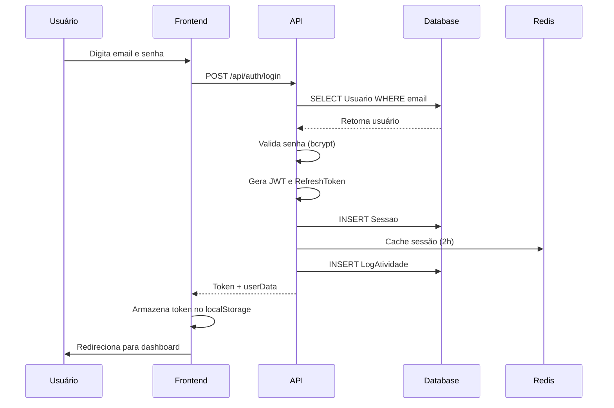
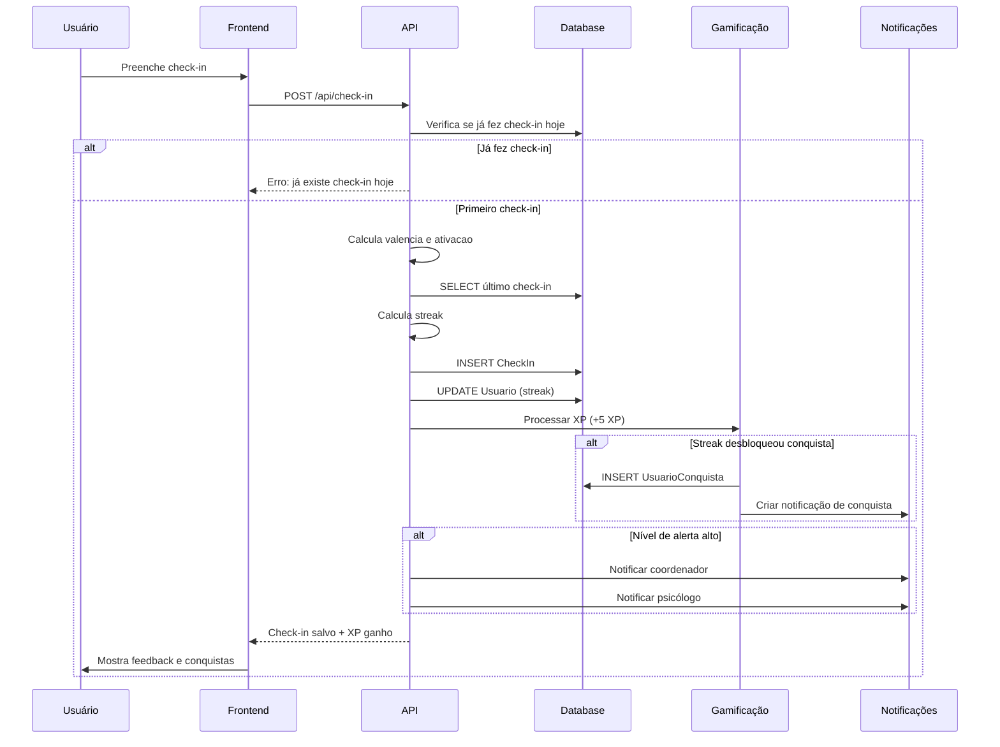
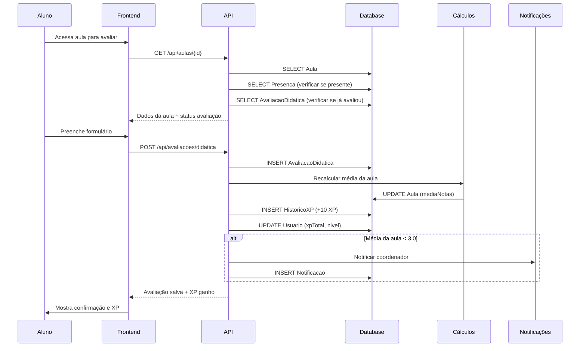
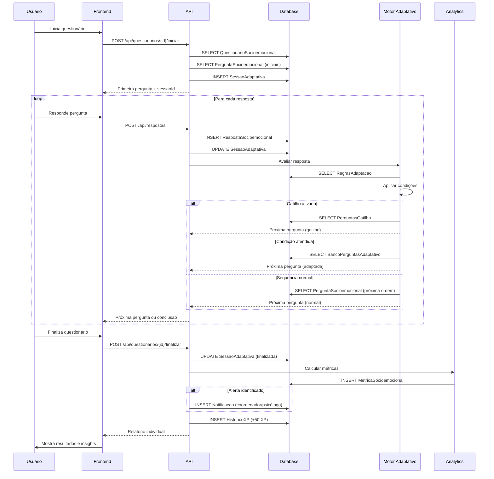

# 📋 Regras de Negócio e Fluxos de Dados - ClassCheck

**Data:** 16 de outubro de 2025  
**Versão:** 1.0

---

## 📖 Índice

1. [Regras de Negócio Gerais](#regras-de-negócio-gerais)
2. [Fluxos de Dados Principais](#fluxos-de-dados-principais)
3. [Sistema de Questionários Adaptativos](#sistema-de-questionários-adaptativos)
4. [Sistema de Gamificação](#sistema-de-gamificação)
5. [Sistema de Alertas](#sistema-de-alertas)
6. [Políticas de Privacidade e LGPD](#políticas-de-privacidade-e-lgpd)

---

## 🎯 Regras de Negócio Gerais

### 1. Usuários e Autenticação

#### RN001 - Cadastro de Usuário
```typescript
// Campos obrigatórios
- email (único, validado)
- senha (min 8 caracteres, hash bcrypt com salt)
- nome completo
- role (ALUNO, PROFESSOR, COORDENADOR, PSICOLOGO, ADMIN)

// Campos opcionais
- matricula (único se preenchido)
- cpf (único se preenchido, validação de CPF)
- dataNascimento
- genero
- foto (URL ou base64, max 2MB)

// Regras
1. Email institucional (@edu.br) tem prioridade
2. CPF só é obrigatório para maiores de 18 anos
3. Foto é validada (formato, tamanho, conteúdo)
4. Senha expira a cada 90 dias (configurável)
5. Primeiro acesso força troca de senha
```

#### RN002 - Autenticação
```typescript
// Processo de login
1. Validar credenciais (email + senha)
2. Verificar se usuário está ativo
3. Gerar token JWT (validade: 2 horas)
4. Gerar refresh token (validade: 7 dias)
5. Criar sessão no banco
6. Registrar log de acesso

// Sessões
- Máximo 3 sessões ativas por usuário
- Sessão inativa por 30min é marcada como expirada
- Logout invalida o token atual
- Logout de todas as sessões limpa todos os tokens

// Tentativas de login
- Max 5 tentativas falhas em 15 minutos
- Bloqueio temporário de 30 minutos após 5 falhas
- Notificação ao email do usuário
- Admin pode desbloquear manualmente
```

#### RN003 - Recuperação de Senha
```typescript
1. Validar se email existe
2. Gerar token único de recuperação (validade: 1 hora)
3. Enviar email com link
4. Link permite criar nova senha
5. Token só pode ser usado uma vez
6. Após troca, todas as sessões são invalidadas
7. Notificação de troca de senha enviada
```

---

### 2. Check-ins Diários

#### RN004 - Criação de Check-in
```typescript
// Frequência
- Máximo 1 check-in por dia por usuário
- Horário ideal: até 10h da manhã
- Notificação enviada às 9h se não fez check-in

// Campos obrigatórios
- humor (PESSIMO, RUIM, NEUTRO, BOM, OTIMO)
- intensidade (1-5)
- nivelEnergia (0-10)

// Campos opcionais mas incentivados
- emocoes (array de emoções)
- qualidadeSono (1-5)
- motivacao (1-5)
- pensamentoPositivo (string)
- precisaApoio (boolean)

// Cálculos automáticos
valencia = calcularValencia(humor, emocoes)
ativacao = calcularAtivacao(nivelEnergia, intensidade)
streakDias = calcularStreak(usuarioId)

// Regras de streak
- Streak incrementa se check-in foi feito no dia anterior
- Pula finais de semana (opcional, configurável)
- Quebra se passar mais de 24h sem check-in em dia útil
- Conquistas desbloqueadas em 7, 30, 60, 100 dias consecutivos
```

#### RN005 - Processamento Pós Check-in
```typescript
// Após salvar check-in
1. Calcular valencia e ativacao (modelo circumplex)
2. Atualizar streak do usuário
3. Verificar se desbloqueou conquista
4. Verificar nível de alerta
5. Se alerta LARANJA ou VERMELHO:
   - Criar notificação para coordenador
   - Criar notificação para psicólogo
   - Sugerir recursos de apoio
6. Atribuir XP (+5 XP por check-in)
7. Se primeiro check-in da semana: +10 XP bônus
8. Atualizar métricas semanais e mensais
```

---

### 3. Avaliações Didáticas

#### RN006 - Avaliação de Aula
```typescript
// Momento da avaliação
- Só pode avaliar aula após ela acontecer
- Janela de avaliação: até 7 dias após a aula
- Notificação enviada 1 dia após a aula
- Lembrete enviado 5 dias após se não avaliou

// Campos obrigatórios
- notaGeral (1-5)
- clareza (1-5)
- metodologia (1-5)
- ritmo (1-5)

// Campos opcionais
- feedbackPositivo (string, max 500 caracteres)
- feedbackMelhoria (string, max 500 caracteres)
- compreendeuConteudo (boolean)
- participacaoAtiva (boolean)
- materiaisAdequados (boolean)

// Restrições
- Cada usuário pode avaliar cada aula apenas uma vez
- Avaliação não pode ser editada após 24h
- Avaliação pode ser deletada apenas pelo admin
- Anonimato configurável (padrão: sim para alunos)
```

#### RN007 - Impacto da Avaliação
```typescript
// Após salvar avaliação
1. Recalcular média da aula
2. Recalcular média do professor
3. Se média < 3.0:
   - Notificar coordenador
   - Sinalizar aula para revisão
4. Atribuir XP ao aluno (+10 XP)
5. Se primeira avaliação do semestre: +20 XP bônus
6. Verificar conquista "Crítico Construtivo"
7. Atualizar dashboard institucional
```

---

### 4. Avaliações de Professores

#### RN008 - Avaliação de Professor
```typescript
// Momento da avaliação
- Janela: últimas 2 semanas do semestre
- Só pode avaliar professores de aulas que assistiu
- Mínimo 50% de presença na disciplina

// Campos obrigatórios
- dominioConteudo (1-5)
- clarezaComunicacao (1-5)
- empatia (1-5)
- paciencia (1-5)

// Campos opcionais
- feedbackConstrutivo (string, max 1000 caracteres)
- recomendaria (boolean)
- melhorAspecto (string)
- aspectoMelhorar (string)

// Anonimato
- Avaliação de professor é SEMPRE anônima
- Professor não pode ver quem avaliou
- Relatório mostra apenas estatísticas agregadas
- Comentários são revisados por IA antes de exibir
```

#### RN009 - Proteção do Professor
```typescript
// Filtros de conteúdo
1. Comentários são analisados por IA
2. Conteúdo ofensivo é bloqueado
3. Identificação pessoal é removida
4. Comentários muito curtos (<10 caracteres) não são aceitos

// Exibição de resultados
- Professor só vê resultados após 5+ avaliações
- Resultados consolidados por semestre
- Gráficos de tendência ao longo do tempo
- Comparação anônima com média departamental

// Intervenção
- Se média < 3.0 em 2 semestres consecutivos:
  - Reunião com coordenação
  - Plano de desenvolvimento individual
  - Mentoria com professor experiente
```

---

## 🔄 Fluxos de Dados Principais

### Fluxo 1: Login e Autenticação



### Fluxo 2: Check-in Diário



### Fluxo 3: Avaliação de Aula



### Fluxo 4: Questionário Socioemocional Adaptativo



---

## 🧠 Sistema de Questionários Adaptativos

### Lógica de Adaptação

#### Nível 1: BAIXO (Adaptação Mínima)
```typescript
// Comportamento
- Segue ordem fixa das perguntas
- Pula perguntas condicionais não aplicáveis
- Exibe todas as perguntas do questionário

// Condições simples
if (resposta.valor === "SIM") {
  exibirPergunta(perguntaGatilho);
}
```

#### Nível 2: MEDIO (Adaptação Moderada)
```typescript
// Comportamento
- Ajusta próxima pergunta baseado na resposta anterior
- Pula seções inteiras se não aplicável
- Altera ordem de perguntas

// Exemplo
if (resposta.ansiedade > 7) {
  proximaPergunta = bancoPerguntasAdaptativo.find(
    p => p.dominio === "ANSIEDADE" && p.nivel === "ALTO"
  );
}
```

#### Nível 3: ALTO (Adaptação Avançada)
```typescript
// Comportamento
- Analisa padrões de múltiplas respostas
- Seleciona perguntas de banco adaptativo
- Ajusta tom e complexidade

// Exemplo
const padraoDetectado = analisarPadroes([
  resposta1, resposta2, resposta3
]);

if (padraoDetectado === "DEPRESSAO_PROVAVEL") {
  proximasPerguntas = bancoPerguntasAdaptativo.filter(
    p => p.dominio === "DEPRESSAO" && 
         p.escalaValidada === "PHQ9"
  );
}
```

#### Nível 4: MUITO_ALTO (Adaptação Inteligente)
```typescript
// Comportamento
- Machine Learning para predição
- Personalização baseada em histórico
- Interrupção precoce se conclusão óbvia

// Exemplo
const risco = modeloML.predizer({
  respostasAtuais,
  historicoUsuario,
  demograficos
});

if (risco.depressao > 0.8) {
  // Interromper e encaminhar para apoio imediato
  interromperQuestionario();
  criarAlertaUrgente();
  sugerirRecursos();
} else {
  // Continuar com perguntas personalizadas
  proximasPerguntas = gerarSequenciaPersonalizada(risco);
}
```

### Regras de Adaptação

#### Tipo: CONDICIONAL_SIMPLES
```typescript
// Condição
if (campo === valor) então acao

// Exemplo
{
  "condicaoTipo": "CONDICIONAL_SIMPLES",
  "condicaoValor": {
    "campo": "humor",
    "operador": "==",
    "valor": "PESSIMO"
  },
  "acaoTipo": "INSERIR_PERGUNTA",
  "acaoParametros": {
    "perguntaId": "uuid-pergunta-aprofundamento"
  }
}
```

#### Tipo: RANGE_NUMERICO
```typescript
// Condição
if (valor >= min && valor <= max) então acao

// Exemplo
{
  "condicaoTipo": "RANGE_NUMERICO",
  "condicaoValor": {
    "campo": "respostaNumero",
    "min": 8,
    "max": 10
  },
  "acaoTipo": "ALTERAR_NIVEL",
  "acaoParametros": {
    "novoNivel": "ALTO"
  }
}
```

#### Tipo: MULTIPLAS_RESPOSTAS
```typescript
// Condição
if (todas as condições são verdadeiras) então acao

// Exemplo
{
  "condicaoTipo": "MULTIPLAS_RESPOSTAS",
  "condicaoValor": {
    "operador": "AND",
    "condicoes": [
      {"campo": "ansiedade", "operador": ">=", "valor": 7},
      {"campo": "qualidadeSono", "operador": "<=", "valor": 2},
      {"campo": "concentracao", "operador": "<=", "valor": 3}
    ]
  },
  "acaoTipo": "INSERIR_PERGUNTA",
  "acaoParametros": {
    "perguntaId": "uuid-escala-gad7"
  }
}
```

#### Tipo: PADRAO_TEMPORAL
```typescript
// Condição
if (padrão detectado no histórico) então acao

// Exemplo
{
  "condicaoTipo": "PADRAO_TEMPORAL",
  "condicaoValor": {
    "periodo": "7_DIAS",
    "metrica": "humor",
    "tendencia": "DECRESCENTE",
    "threshold": -0.5 // Queda de 0.5 pontos/dia
  },
  "acaoTipo": "CRIAR_ALERTA",
  "acaoParametros": {
    "nivelAlerta": "LARANJA",
    "notificar": ["COORDENADOR", "PSICOLOGO"]
  }
}
```

---

## 🎮 Sistema de Gamificação

### Cálculo de XP

```typescript
// Base de XP por atividade
const XP_BASE = {
  CHECK_IN: 5,
  CHECK_IN_PRIMEIRA_SEMANA: 10, // Bônus
  AVALIACAO_DIDATICA: 10,
  AVALIACAO_DIDATICA_PRIMEIRA: 20, // Bônus
  AVALIACAO_PROFESSOR: 25,
  QUESTIONARIO_SOCIOEMOCIONAL: 50,
  QUESTIONARIO_COMPLETO_PRIMEIRA_VEZ: 100, // Bônus
  PARTICIPACAO_AULA: 3,
  ENTREGA_ATIVIDADE: 15,
  ENTREGA_ATIVIDADE_ANTECIPADA: 30, // Bônus
};

// Multiplicadores
const MULTIPLICADORES = {
  STREAK_7_DIAS: 1.1,    // +10%
  STREAK_30_DIAS: 1.25,  // +25%
  STREAK_100_DIAS: 1.5,  // +50%
  FIM_DE_SEMANA: 1.2,    // +20%
  EVENTO_ESPECIAL: 2.0,  // +100%
};

// Fórmula final
xpGanho = XP_BASE[atividade] * MULTIPLICADOR * (1 + bonusConquistas)

// Exemplo
usuario.streak = 35; // 30+ dias
atividade = "CHECK_IN";
xpBase = 5;
multiplicador = 1.25; // Streak 30 dias
bonusConquistas = 0.05; // 5% de 2 conquistas especiais

xpGanho = 5 * 1.25 * 1.05 = 6.56 ≈ 7 XP
```

### Cálculo de Nível

```typescript
// Progressão exponencial suavizada
nivel = Math.floor(Math.sqrt(xpTotal / 100)) + 1;

// XP necessário para próximo nível
xpProximoNivel = Math.pow(nivel, 2) * 100;

// Progresso percentual
percentualProgresso = ((xpTotal - xpNivelAtual) / (xpProximoNivel - xpNivelAtual)) * 100;

// Tabela de referência
NIVEL 1:  0 XP
NIVEL 2:  100 XP
NIVEL 3:  400 XP
NIVEL 5:  1,600 XP
NIVEL 10: 10,000 XP
NIVEL 20: 40,000 XP
NIVEL 50: 250,000 XP
```

### Conquistas

#### Categorias de Conquistas

```typescript
enum TipoConquista {
  // Frequência
  PRIMEIRO_CHECK_IN = "Primeiro Check-in",
  STREAK_7_DIAS = "Semana Completa",
  STREAK_30_DIAS = "Mês Dedicado",
  STREAK_100_DIAS = "Centenário",
  
  // Avaliações
  PRIMEIRA_AVALIACAO = "Primeira Opinião",
  AVALIACOES_50 = "Crítico Ativo",
  AVALIACOES_100 = "Mestre dos Feedbacks",
  
  // Participação
  PRESENCA_100PCT = "Assíduo",
  PARTICIPACOES_50 = "Engajado",
  
  // Socioemocional
  QUESTIONARIO_COMPLETO = "Autoconhecimento",
  APOIO_SOLICITADO = "Coragem",
  MELHORA_EMOCIONAL = "Superação",
  
  // Gamificação
  NIVEL_10 = "Persistente",
  NIVEL_50 = "Lenda",
  BADGES_10 = "Colecionador",
  
  // Especiais
  AJUDOU_COLEGA = "Solidário",
  FEEDBACK_CONSTRUTIVO = "Mentor",
  EVOLUCAO_ACADEMICA = "Crescimento",
}

// Raridade
enum Raridade {
  COMUM = 1,      // 60% dos usuários
  INCOMUM = 2,    // 30% dos usuários
  RARO = 3,       // 10% dos usuários
  EPICO = 4,      // 3% dos usuários
  LENDARIO = 5,   // 1% dos usuários
}
```

#### Sistema de Desbloqueio

```typescript
// Verificar conquistas após cada ação
async function verificarConquistas(usuarioId: string, acao: string) {
  const usuario = await db.usuario.findUnique({
    where: { id: usuarioId },
    include: {
      conquistas: true,
      checkIns: true,
      avaliacoes: true,
    }
  });
  
  const conquistasNovas: Conquista[] = [];
  
  // Verificar cada tipo de conquista
  if (acao === "CHECK_IN") {
    // Streak de 7 dias
    if (usuario.streakAtual === 7 && !temConquista("STREAK_7_DIAS")) {
      conquistasNovas.push(CONQUISTA_STREAK_7);
    }
    
    // Streak de 30 dias
    if (usuario.streakAtual === 30 && !temConquista("STREAK_30_DIAS")) {
      conquistasNovas.push(CONQUISTA_STREAK_30);
    }
    
    // Streak de 100 dias
    if (usuario.streakAtual === 100 && !temConquista("STREAK_100_DIAS")) {
      conquistasNovas.push(CONQUISTA_STREAK_100);
    }
  }
  
  if (acao === "AVALIACAO") {
    const totalAvaliacoes = usuario.avaliacoes.length;
    
    if (totalAvaliacoes === 50 && !temConquista("AVALIACOES_50")) {
      conquistasNovas.push(CONQUISTA_AVALIACOES_50);
    }
  }
  
  if (acao === "NIVEL_UP") {
    if (usuario.nivel === 10 && !temConquista("NIVEL_10")) {
      conquistasNovas.push(CONQUISTA_NIVEL_10);
    }
  }
  
  // Desbloquear conquistas
  for (const conquista of conquistasNovas) {
    await db.usuarioConquista.create({
      data: {
        usuarioId: usuario.id,
        conquistaId: conquista.id,
      }
    });
    
    // Atribuir XP da conquista
    await adicionarXP(usuario.id, conquista.xp, "CONQUISTA");
    
    // Notificar usuário
    await criarNotificacao({
      usuarioId: usuario.id,
      tipo: "CONQUISTA_DESBLOQUEADA",
      titulo: `Conquista desbloqueada: ${conquista.titulo}!`,
      prioridade: "ALTA",
    });
  }
  
  return conquistasNovas;
}
```

### Badges

```typescript
// Badges evoluem em níveis
interface Badge {
  codigo: string;
  nome: string;
  categoria: CategoriaBadge;
  niveis: {
    BRONZE: { requisito: string; xp: number };
    PRATA: { requisito: string; xp: number };
    OURO: { requisito: string; xp: number };
    PLATINA: { requisito: string; xp: number };
    DIAMANTE: { requisito: string; xp: number };
  };
}

// Exemplo: Badge de Check-in
const BADGE_CHECKIN: Badge = {
  codigo: "CHECKIN_MASTER",
  nome: "Mestre do Check-in",
  categoria: "FREQUENCIA",
  niveis: {
    BRONZE: {
      requisito: "7 check-ins consecutivos",
      xp: 50,
    },
    PRATA: {
      requisito: "30 check-ins consecutivos",
      xp: 100,
    },
    OURO: {
      requisito: "60 check-ins consecutivos",
      xp: 200,
    },
    PLATINA: {
      requisito: "100 check-ins consecutivos",
      xp: 500,
    },
    DIAMANTE: {
      requisito: "365 check-ins consecutivos",
      xp: 2000,
    },
  },
};

// Progresso do badge
function calcularProgressoBadge(usuario, badge) {
  const nivelAtual = usuario.badges.find(b => b.badgeId === badge.id)?.nivel || null;
  const proximoNivel = obterProximoNivel(nivelAtual);
  
  if (!proximoNivel) return { completo: true };
  
  const requisito = badge.niveis[proximoNivel].requisito;
  const progresso = calcularProgressoRequisito(usuario, requisito);
  
  return {
    nivelAtual,
    proximoNivel,
    progresso, // 0-100
    completo: progresso >= 100,
  };
}
```

---

## 🚨 Sistema de Alertas

### Níveis de Alerta

```typescript
enum NivelAlerta {
  VERDE = "VERDE",       // Tudo bem
  AMARELO = "AMARELO",   // Atenção
  LARANJA = "LARANJA",   // Preocupante
  VERMELHO = "VERMELHO", // Crítico
}

// Critérios por categoria
const CRITERIOS_ALERTA = {
  CHECK_IN: {
    VERDE: {
      humor: >= 4,
      intensidade: >= 4,
      nivelEnergia: >= 7,
    },
    AMARELO: {
      humor: 3,
      intensidade: 3,
      nivelEnergia: 5-6,
      condicao: "OU diasSemCheckIn >= 3",
    },
    LARANJA: {
      humor: 2,
      intensidade: <= 2,
      nivelEnergia: 3-4,
      condicao: "OU (humor <= 3 por 3+ dias consecutivos)",
    },
    VERMELHO: {
      humor: 1,
      intensidade: 1,
      nivelEnergia: <= 2,
      condicao: "OU (humor <= 2 por 5+ dias consecutivos) OU precisaApoio === true",
    },
  },
  
  QUESTIONARIO: {
    VERDE: {
      pontuacao: < 5,
      categoriasAlerta: 0,
    },
    AMARELO: {
      pontuacao: 5-9,
      categoriasAlerta: 1-2,
    },
    LARANJA: {
      pontuacao: 10-14,
      categoriasAlerta: 3-4,
    },
    VERMELHO: {
      pontuacao: >= 15,
      categoriasAlerta: >= 5,
      condicao: "OU (pensamentosSuicidas === true)",
    },
  },
  
  PRESENCA: {
    VERDE: {
      percentualPresenca: >= 85,
    },
    AMARELO: {
      percentualPresenca: 70-84,
    },
    LARANJA: {
      percentualPresenca: 50-69,
    },
    VERMELHO: {
      percentualPresenca: < 50,
      condicao: "OU (faltasConsecutivas >= 5)",
    },
  },
};
```

### Ações Automáticas por Alerta

```typescript
async function processarAlerta(usuarioId: string, tipo: TipoAlerta, nivel: NivelAlerta) {
  switch (nivel) {
    case "VERDE":
      // Nenhuma ação necessária
      break;
      
    case "AMARELO":
      // Notificar o próprio usuário
      await criarNotificacao({
        usuarioId,
        tipo: "ALERTA_BEM_ESTAR",
        titulo: "Como você está?",
        mensagem: "Percebemos que você pode estar passando por um momento difícil. Que tal fazer um check-in?",
        prioridade: "MEDIA",
      });
      
      // Sugerir recursos
      await sugerirRecursos(usuarioId, [
        "TECNICAS_RELAXAMENTO",
        "VIDEOS_MOTIVACIONAIS",
        "ARTIGOS_BEM_ESTAR",
      ]);
      break;
      
    case "LARANJA":
      // Notificar usuário
      await criarNotificacao({
        usuarioId,
        tipo: "ALERTA_BEM_ESTAR",
        titulo: "Estamos aqui para você",
        mensagem: "Notamos que você pode precisar de apoio. Considere conversar com um de nossos psicólogos.",
        prioridade: "ALTA",
      });
      
      // Notificar coordenador
      const coordenador = await obterCoordenadorDepartamento(usuarioId);
      await criarNotificacao({
        usuarioId: coordenador.id,
        tipo: "ALERTA_ALUNO",
        titulo: `Alerta: ${obterNomeParcial(usuarioId)}`,
        mensagem: "Aluno apresenta sinais de necessidade de apoio.",
        prioridade: "ALTA",
        metadata: {
          alunoId: usuarioId,
          nivelAlerta: "LARANJA",
          tipoAlerta: tipo,
        },
      });
      
      // Notificar psicólogo
      const psicologo = await obterPsicologoDisponivel();
      await criarNotificacao({
        usuarioId: psicologo.id,
        tipo: "ALERTA_ALUNO",
        titulo: `Acompanhamento recomendado`,
        mensagem: "Aluno com necessidade de suporte socioemocional.",
        prioridade: "ALTA",
        metadata: {
          alunoId: usuarioId,
          nivelAlerta: "LARANJA",
          tipoAlerta: tipo,
        },
      });
      
      // Oferecer agendamento direto
      await criarOfertaAgendamento(usuarioId, psicologo.id);
      break;
      
    case "VERMELHO":
      // Notificar usuário com recursos de emergência
      await criarNotificacao({
        usuarioId,
        tipo: "ALERTA_URGENTE",
        titulo: "Procure ajuda agora",
        mensagem: "Estamos muito preocupados com você. Por favor, entre em contato com nosso suporte imediatamente.",
        prioridade: "URGENTE",
        acoes: [
          {
            label: "Ligar para o CVV (188)",
            tipo: "TELEFONE",
            valor: "188",
          },
          {
            label: "Agendar atendimento urgente",
            tipo: "AGENDAMENTO",
            valor: "urgente",
          },
          {
            label: "Chat de apoio",
            tipo: "CHAT",
            valor: "suporte-urgente",
          },
        ],
      });
      
      // Notificar coordenador (URGENTE)
      const coordenador = await obterCoordenadorDepartamento(usuarioId);
      await criarNotificacao({
        usuarioId: coordenador.id,
        tipo: "ALERTA_CRITICO",
        titulo: `URGENTE: ${obterNomeParcial(usuarioId)}`,
        mensagem: "Aluno em situação crítica. Ação imediata necessária.",
        prioridade: "URGENTE",
        metadata: {
          alunoId: usuarioId,
          nivelAlerta: "VERMELHO",
          tipoAlerta: tipo,
          telefone: await obterTelefoneEmergencia(usuarioId),
        },
      });
      
      // Notificar psicólogo (URGENTE)
      const psicologos = await obterTodosPsicologos();
      for (const psicologo of psicologos) {
        await criarNotificacao({
          usuarioId: psicologo.id,
          tipo: "ALERTA_CRITICO",
          titulo: `INTERVENÇÃO URGENTE`,
          mensagem: "Aluno em situação de risco. Atendimento imediato necessário.",
          prioridade: "URGENTE",
          metadata: {
            alunoId: usuarioId,
            nivelAlerta: "VERMELHO",
            tipoAlerta: tipo,
          },
        });
      }
      
      // Criar protocolo de emergência
      await criarProtocoloEmergencia(usuarioId);
      
      // Log especial
      await db.logAtividade.create({
        data: {
          usuarioId,
          acao: "ALERTA_VERMELHO_ACIONADO",
          entidade: "SISTEMA_ALERTA",
          nivelCriticidade: "CRITICO",
          requeredIntervencao: true,
        },
      });
      break;
  }
}
```

---

## 🔒 Políticas de Privacidade e LGPD

### Princípios

```typescript
// 1. Minimização de Dados
- Coletar apenas dados estritamente necessários
- Não armazenar dados sensíveis desnecessários
- Anonimizar sempre que possível

// 2. Finalidade
- Dados coletados apenas para fins educacionais e bem-estar
- Uso secundário requer consentimento explícito
- Não compartilhar com terceiros sem autorização

// 3. Transparência
- Usuário pode ver todos os seus dados
- Exportar dados em formato legível (JSON, PDF)
- Histórico de acesso e modificações disponível

// 4. Direito ao Esquecimento
- Usuário pode deletar conta a qualquer momento
- Dados são anonimizados, não deletados (para pesquisa)
- Processo irreversível após 30 dias

// 5. Segurança
- Criptografia em trânsito (HTTPS) e em repouso
- Senhas com bcrypt (salt rounds >= 12)
- Tokens JWT com expiração curta
- Sessões invalidadas em logout
```

### Consentimentos

```typescript
interface Consentimento {
  tipo: TipoConsentimento;
  obrigatorio: boolean;
  finalidade: string;
  dataConsentimento: Date;
  dataRevogacao?: Date;
}

enum TipoConsentimento {
  // Obrigatórios (não pode usar sistema sem eles)
  TERMOS_USO = "Termos de Uso",
  POLITICA_PRIVACIDADE = "Política de Privacidade",
  COLETA_DADOS_BASICOS = "Coleta de Dados Básicos",
  
  // Opcionais
  PESQUISA_ACADEMICA = "Uso para Pesquisa Acadêmica",
  COMPARTILHAMENTO_ANONIMO = "Compartilhamento de Dados Anonimizados",
  NOTIFICACOES_EMAIL = "Receber Notificações por Email",
  NOTIFICACOES_PUSH = "Receber Notificações Push",
  GAMIFICACAO = "Participar de Gamificação",
  RANKING_PUBLICO = "Aparecer em Rankings Públicos",
}

// Fluxo de consentimento
async function solicitarConsentimento(usuarioId: string, tipo: TipoConsentimento) {
  const consentimento = await db.consentimento.findFirst({
    where: { usuarioId, tipo },
  });
  
  if (consentimento && !consentimento.dataRevogacao) {
    return true; // Já consentiu
  }
  
  // Exibir termo e aguardar resposta
  const resposta = await exibirTermoConsentimento(tipo);
  
  if (resposta === "ACEITO") {
    await db.consentimento.create({
      data: {
        usuarioId,
        tipo,
        dataConsentimento: new Date(),
        ipAddress: obterIP(),
      },
    });
    return true;
  }
  
  return false;
}
```

### Anonimização de Dados

```typescript
// Processo de anonimização (quando usuário deleta conta)
async function anonimizarDados(usuarioId: string) {
  // 1. Gerar ID anonimizado
  const anonId = gerarHashAnonimo(usuarioId);
  
  // 2. Atualizar Usuario
  await db.usuario.update({
    where: { id: usuarioId },
    data: {
      email: `${anonId}@anonimizado.local`,
      nome: "Usuário Anonimizado",
      senha: gerarHashAleatorio(),
      cpf: null,
      matricula: null,
      dataNascimento: null,
      genero: null,
      foto: null,
      telefone: null,
      ativo: false,
      deletadoEm: new Date(),
    },
  });
  
  // 3. Anonimizar dados relacionados
  await db.checkIn.updateMany({
    where: { usuarioId },
    data: {
      pensamentoPositivo: null,
      observacoes: null,
    },
  });
  
  await db.avaliacaoDidatica.updateMany({
    where: { usuarioId },
    data: {
      feedbackPositivo: "[feedback anonimizado]",
      feedbackMelhoria: "[feedback anonimizado]",
    },
  });
  
  await db.avaliacaoProfessor.updateMany({
    where: { usuarioId },
    data: {
      feedbackConstrutivo: "[feedback anonimizado]",
      melhorAspecto: "[anonimizado]",
      aspectoMelhorar: "[anonimizado]",
    },
  });
  
  // 4. Deletar dados sensíveis
  await db.sessao.deleteMany({ where: { usuarioId } });
  await db.notificacao.deleteMany({ where: { usuarioId } });
  
  // 5. Manter dados estatísticos (anonimizados)
  // CheckIns, Avaliacoes, Respostas permanecem com usuarioId anonimizado
  // para fins de pesquisa e métricas agregadas
  
  // 6. Log de anonimização
  await db.logAtividade.create({
    data: {
      usuarioId: anonId,
      acao: "CONTA_ANONIMIZADA",
      entidade: "USUARIO",
      entidadeId: usuarioId,
      detalhes: "Dados anonimizados conforme LGPD",
    },
  });
}
```

### Auditoria e Compliance

```typescript
// Registrar todos os acessos a dados sensíveis
async function registrarAcessoDados(
  usuarioId: string,
  entidade: string,
  entidadeId: string,
  operacao: "LEITURA" | "ESCRITA" | "EXCLUSAO"
) {
  await db.logAtividade.create({
    data: {
      usuarioId,
      acao: `ACESSO_${operacao}`,
      entidade,
      entidadeId,
      ipAddress: obterIP(),
      userAgent: obterUserAgent(),
      timestamp: new Date(),
    },
  });
}

// Exemplo: Coordenador acessando dados de aluno
async function verDadosAluno(coordenadorId: string, alunoId: string) {
  // Verificar permissão
  if (!temPermissao(coordenadorId, "VER_DADOS_ALUNO")) {
    throw new Error("Sem permissão");
  }
  
  // Registrar acesso
  await registrarAcessoDados(
    coordenadorId,
    "USUARIO",
    alunoId,
    "LEITURA"
  );
  
  // Retornar dados (sem informações ultra-sensíveis)
  const aluno = await db.usuario.findUnique({
    where: { id: alunoId },
    select: {
      id: true,
      nome: true,
      email: true,
      matricula: true,
      // CPF, dataNascimento, etc. não são retornados
    },
  });
  
  return aluno;
}

// Relatório de compliance
async function gerarRelatorioCompliance(periodo: { inicio: Date; fim: Date }) {
  return {
    totalUsuarios: await db.usuario.count(),
    usuariosAtivos: await db.usuario.count({ where: { ativo: true } }),
    usuariosAnonimizados: await db.usuario.count({ where: { deletadoEm: { not: null } } }),
    
    consentimentos: {
      total: await db.consentimento.count({ where: { dataConsentimento: { gte: periodo.inicio, lte: periodo.fim } } }),
      revogacoes: await db.consentimento.count({ where: { dataRevogacao: { gte: periodo.inicio, lte: periodo.fim } } }),
    },
    
    acessosDados: {
      leitura: await db.logAtividade.count({ where: { acao: "ACESSO_LEITURA", criadoEm: { gte: periodo.inicio, lte: periodo.fim } } }),
      escrita: await db.logAtividade.count({ where: { acao: "ACESSO_ESCRITA", criadoEm: { gte: periodo.inicio, lte: periodo.fim } } }),
      exclusao: await db.logAtividade.count({ where: { acao: "ACESSO_EXCLUSAO", criadoEm: { gte: periodo.inicio, lte: periodo.fim } } }),
    },
    
    incidentes: await db.incidenteSeguranca.count({ where: { criadoEm: { gte: periodo.inicio, lte: periodo.fim } } }),
  };
}
```

---

## ✅ Checklist de Implementação

### Fase 1: Core (Semanas 1-2)
- [ ] Implementar schema Prisma completo
- [ ] Criar migrations iniciais
- [ ] Implementar autenticação JWT
- [ ] Criar seeds de dados de teste
- [ ] Testes unitários dos models

### Fase 2: Funcionalidades Básicas (Semanas 3-4)
- [ ] APIs de Check-in
- [ ] APIs de Avaliações Didáticas
- [ ] Sistema de XP e níveis
- [ ] Notificações básicas
- [ ] Dashboard de usuário

### Fase 3: Questionários Adaptativos (Semanas 5-6)
- [ ] Motor de adaptação de perguntas
- [ ] Banco de perguntas adaptativo
- [ ] Regras de adaptação configuráveis
- [ ] Analytics de respostas
- [ ] Relatórios socioemocionais

### Fase 4: Gamificação (Semana 7)
- [ ] Sistema de conquistas
- [ ] Sistema de badges
- [ ] Rankings e leaderboards
- [ ] Notificações de desbloqueios
- [ ] Perfil gamificado

### Fase 5: Alertas e Intervenção (Semana 8)
- [ ] Sistema de níveis de alerta
- [ ] Detecção automática de padrões
- [ ] Fluxo de notificações por nível
- [ ] Protocolo de emergência
- [ ] Integração com recursos de apoio

### Fase 6: LGPD e Compliance (Semana 9)
- [ ] Sistema de consentimentos
- [ ] Anonimização de dados
- [ ] Auditoria completa
- [ ] Exportação de dados
- [ ] Relatórios de compliance

### Fase 7: Performance e Otimização (Semana 10)
- [ ] Criar índices otimizados
- [ ] Implementar views materializadas
- [ ] Configurar cache (Redis)
- [ ] Testes de carga
- [ ] Monitoramento (Grafana/Prometheus)

---

**Mantido por:** Equipe ClassCheck  
**Última atualização:** 16 de outubro de 2025  
**Versão:** 1.0
