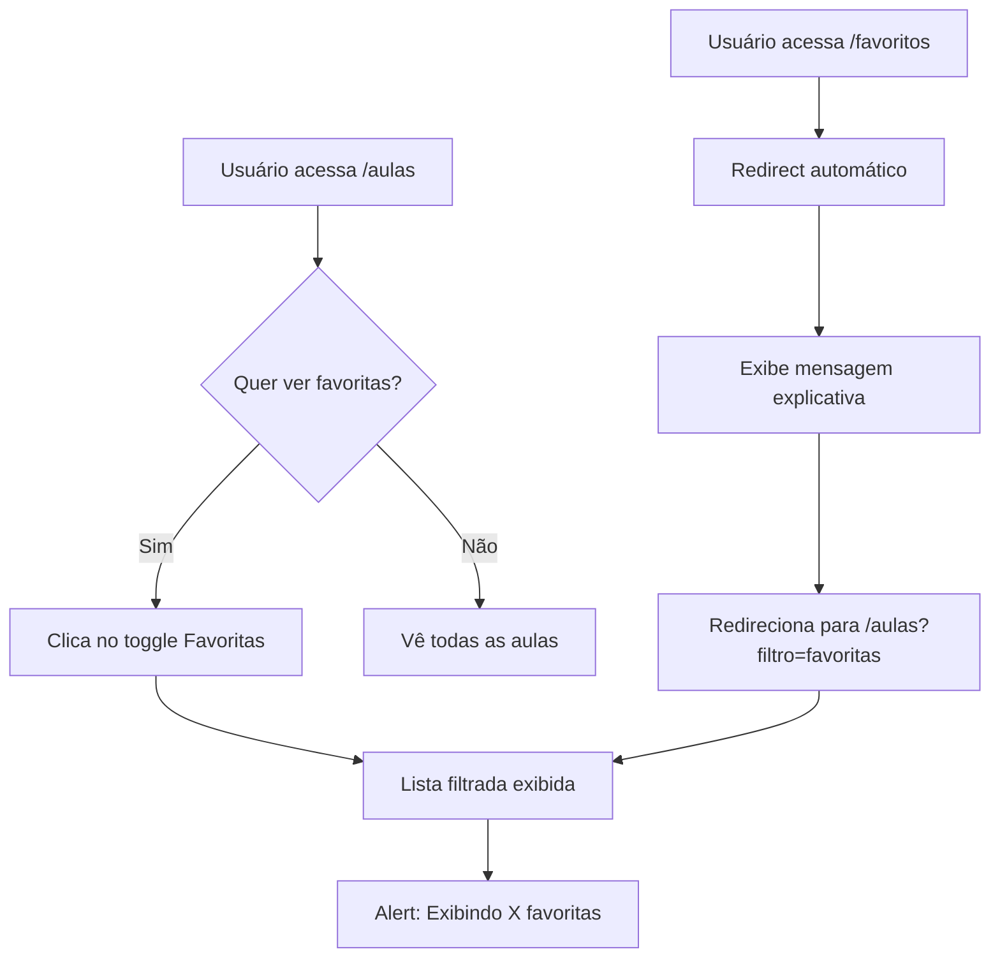

# 📋 RELATÓRIO FASE 3 - PASSO 1: Integração de Favoritos
**ClassCheck v3.0 - Reestruturação Funcional**

---

## 🎯 SITUAÇÃO ATUAL

### Status Geral do Projeto
- ✅ **FASE 1 CONCLUÍDA**: Unificação de Dashboard e Integração de Exportação (Merged)
- ✅ **FASE 2 CONCLUÍDA**: Consolidação de Questionários e Ajuda/Suporte (Merged)
- 🔄 **FASE 3 EM ANÁLISE**: Refinamentos e Limpeza Final

### Progresso do Refactoring
```
Fase 1: ████████████████████ 100% ✅
Fase 2: ████████████████████ 100% ✅
Fase 3: ████░░░░░░░░░░░░░░░░  20% 🔄
```

### Branch Planejada
- Base: `develop`
- Nova branch: `refactor/phase3-help-and-cleanup`

---

## 📊 ANÁLISE TÉCNICA - FASE 3 PASSO 1

### Objetivo do Passo
**Integrar a funcionalidade de favoritos dentro da página de aulas**, eliminando a rota `/favoritos` e criando uma experiência unificada de visualização de aulas.

### Problema Identificado

Atualmente temos **redundância funcional** entre duas rotas:

| Rota | Funcionalidade | Problema |
|------|----------------|----------|
| `/aulas` | Lista todas as aulas disponíveis | Não mostra apenas favoritas |
| `/favoritos` | Lista apenas aulas favoritas | Duplicação de código e UI |

**Análise de Redundância:**
- Ambas exibem **listas de aulas**
- Ambas usam **componentes similares** (cards de aula)
- Ambas têm **filtros e busca**
- Navegação confusa: usuário não sabe onde ir
- Manutenção duplicada de código

### Impacto nos Usuários
- **Confusão de UX**: Duas páginas para ver aulas
- **Navegação fragmentada**: Mais cliques necessários
- **Inconsistência visual**: Páginas com layouts diferentes

---

## 🎯 PROPOSTA DE IMPLEMENTAÇÃO

### Estratégia Recomendada: **Filtro Toggle Integrado**

**Página Unificada:** `/aulas`

**Estrutura Proposta:**

```tsx
// Cabeçalho da página
<PageHeader 
  title="Minhas Aulas"
  description="Gerencie e avalie suas aulas"
  actions={
    <div className="flex items-center gap-3">
      {/* Toggle de Favoritas */}
      <ToggleFilter 
        name="Favoritas" 
        icon={<Star />}
        active={showOnlyFavorites}
        onChange={setShowOnlyFavorites}
      />
      
      {/* Outros filtros existentes */}
      <FilterDropdown />
      <SortDropdown />
    </div>
  }
/>

// Lista de aulas (filtrada)
<AulasList 
  aulas={showOnlyFavorites ? aulasFavoritas : todasAulas}
/>
```

---

## 🔧 PLANO DE IMPLEMENTAÇÃO DETALHADO

### Cronograma Estimado: **4-6 horas**

#### Etapa 1: Criar Componente ToggleFilter (1-2h)

**Arquivo:** `src/components/aulas/ToggleFilter.tsx`

**Funcionalidades:**
- Toggle button com ícone de estrela
- Estado ativo/inativo com visual distinto
- Contador de aulas favoritas
- Animação suave de transição
- Dark mode completo

**Exemplo de Implementação:**

```tsx
'use client';

import { Star } from 'lucide-react';
import { Badge } from '@/components/ui/badge';
import { Button } from '@/components/ui/button';

interface ToggleFilterProps {
  active: boolean;
  count: number;
  onChange: (active: boolean) => void;
}

export function ToggleFilter({ active, count, onChange }: ToggleFilterProps) {
  return (
    <Button
      variant={active ? "default" : "outline"}
      size="sm"
      onClick={() => onChange(!active)}
      className="relative"
    >
      <Star className={`h-4 w-4 mr-2 ${active ? 'fill-yellow-400' : ''}`} />
      Favoritas
      {count > 0 && (
        <Badge 
          variant="secondary" 
          className="ml-2 px-1.5 py-0.5 text-xs"
        >
          {count}
        </Badge>
      )}
    </Button>
  );
}
```

#### Etapa 2: Modificar Página /aulas (2-3h)

**Arquivo:** `src/app/aulas/page.tsx`

**Modificações Necessárias:**

1. **Adicionar estado de filtro:**
```tsx
const [showOnlyFavorites, setShowOnlyFavorites] = useState(false);
```

2. **Filtrar aulas baseado no estado:**
```tsx
const aulasExibidas = useMemo(() => {
  if (showOnlyFavorites) {
    return aulas.filter(aula => aula.isFavorita);
  }
  return aulas;
}, [aulas, showOnlyFavorites]);
```

3. **Integrar ToggleFilter no header:**
```tsx
<PageHeader
  title="Minhas Aulas"
  actions={
    <div className="flex items-center gap-2">
      <ToggleFilter
        active={showOnlyFavorites}
        count={aulas.filter(a => a.isFavorita).length}
        onChange={setShowOnlyFavorites}
      />
      {/* Filtros existentes */}
    </div>
  }
/>
```

4. **Adicionar feedback visual quando filtro ativo:**
```tsx
{showOnlyFavorites && (
  <Alert className="mb-4">
    <Star className="h-4 w-4 fill-yellow-400" />
    <AlertDescription>
      Exibindo apenas aulas favoritas ({aulasExibidas.length})
    </AlertDescription>
  </Alert>
)}
```

#### Etapa 3: Criar Redirecionamento /favoritos (30min)

**Arquivo:** `src/app/favoritos/page.tsx`

**Implementação:**

```tsx
'use client';

import { useEffect } from 'react';
import { useRouter } from 'next/navigation';
import { Card, CardContent, CardDescription, CardHeader, CardTitle } from '@/components/ui/card';
import { Info, ArrowRight, Star } from 'lucide-react';

export default function FavoritosRedirect() {
  const router = useRouter();

  useEffect(() => {
    const timer = setTimeout(() => {
      router.replace('/aulas?filtro=favoritas');
    }, 2000);

    return () => clearTimeout(timer);
  }, [router]);

  return (
    <div className="flex items-center justify-center min-h-screen bg-gray-50 dark:bg-gray-950 px-4">
      <Card className="max-w-md w-full">
        <CardHeader>
          <div className="flex items-center gap-3 mb-2">
            <Info className="h-6 w-6 text-blue-600 dark:text-blue-400" />
            <CardTitle>Redirecionando...</CardTitle>
          </div>
          <CardDescription>
            Esta página foi integrada à página de Aulas
          </CardDescription>
        </CardHeader>
        <CardContent className="space-y-4">
          <div className="flex items-center gap-3 p-4 bg-yellow-50 dark:bg-yellow-950/20 rounded-lg border border-yellow-200 dark:border-yellow-800">
            <Star className="h-8 w-8 text-yellow-600 dark:text-yellow-400 fill-yellow-400" />
            <div className="flex-1">
              <p className="text-sm font-medium text-yellow-900 dark:text-yellow-100">
                Nova Localização
              </p>
              <p className="text-sm text-yellow-700 dark:text-yellow-300 mt-1">
                /aulas (com filtro "Favoritas")
              </p>
            </div>
            <ArrowRight className="h-5 w-5 text-yellow-600 dark:text-yellow-400 animate-pulse" />
          </div>

          <p className="text-sm text-muted-foreground">
            Suas aulas favoritas agora podem ser visualizadas diretamente na página de 
            <strong> Aulas</strong>, usando o novo filtro "Favoritas" no cabeçalho.
          </p>

          <div className="pt-2">
            <div className="flex items-center justify-center">
              <div className="animate-spin rounded-full h-8 w-8 border-b-2 border-primary"></div>
            </div>
            <p className="text-center text-sm text-muted-foreground mt-2">
              Você será redirecionado automaticamente...
            </p>
          </div>
        </CardContent>
      </Card>
    </div>
  );
}
```

#### Etapa 4: Atualizar Navegação (30min)

**Arquivo:** `src/components/app-sidebar.tsx`

**Modificação:**

```diff
const navItems = [
  { label: "Dashboard", icon: Home, href: "/dashboard" },
  { label: "Aulas", icon: BookOpen, href: "/aulas" },
  { label: "Avaliações", icon: Heart, href: "/avaliacoes" },
  { label: "Avaliação Socioemocional", icon: Target, href: "/avaliacao-socioemocional" },
  { label: "Gamificação", icon: Trophy, href: "/gamificacao" },
  { label: "Insights", icon: BarChart3, href: "/insights" },
  { label: "Relatórios", icon: FileText, href: "/relatorios" },
- { label: "Favoritas", icon: Star, href: "/favoritos" },
  { label: "Eventos", icon: Calendar, href: "/eventos" },
]
```

**Arquivo:** `src/components/ConditionalLayout.tsx`

**Modificação:**

```diff
const showNavRoutes = [
  '/dashboard',
  '/aulas', 
  '/avaliacoes',
  '/avaliacao-socioemocional',
  '/gamificacao',
  '/insights',
  '/relatorios',
  '/ajuda',
- '/favoritos', 
  '/eventos'
]
```

#### Etapa 5: Adicionar Query Param Support (30min)

**Melhorar a experiência** permitindo links diretos:

```tsx
// Em src/app/aulas/page.tsx
import { useSearchParams } from 'next/navigation';

export default function AulasPage() {
  const searchParams = useSearchParams();
  const filtroInicial = searchParams.get('filtro') === 'favoritas';
  
  const [showOnlyFavorites, setShowOnlyFavorites] = useState(filtroInicial);
  
  // ... resto do código
}
```

Isso permite URLs como:
- `/aulas` - Todas as aulas
- `/aulas?filtro=favoritas` - Apenas favoritas

---

## 🚨 RISCOS E MITIGAÇÕES

### Riscos Técnicos

| Risco | Probabilidade | Impacto | Mitigação |
|-------|---------------|---------|-----------|
| Perda de funcionalidade de favoritos | Baixa | Alto | Manter toda a lógica, apenas mudar UI |
| Links externos quebrados | Média | Médio | Redirect permanente por 60 dias |
| Performance com muitas aulas | Baixa | Médio | Usar useMemo para filtros |
| Estado do filtro não persistir | Média | Baixo | Usar localStorage ou query params |

### Riscos de UX

| Risco | Probabilidade | Impacto | Mitigação |
|-------|---------------|---------|-----------|
| Usuários não encontram favoritas | Média | Alto | Tooltip + badge com contador |
| Confusão inicial | Média | Médio | Banner explicativo na primeira visita |
| Muscle memory (usuários habituados) | Alta | Baixo | Redirect com mensagem clara |

### Estratégias de Mitigação

1. **Redirecionamento Inteligente:**
   - Manter `/favoritos` redirecionando por período de transição
   - Mensagem visual explicando mudança
   - Link direto para nova localização

2. **Feedback Visual:**
   - Badge com contador de favoritas no botão
   - Alert quando filtro ativo
   - Animação suave ao toggle

3. **Persistência de Estado:**
   - Salvar preferência do usuário em localStorage
   - Restaurar estado ao retornar à página

4. **Educação do Usuário:**
   - Tooltip no primeiro acesso: "Favoritas agora aqui!"
   - Changelog visível
   - Tutorial in-app opcional

---

## 📋 CHECKLIST DE IMPLEMENTAÇÃO

### Desenvolvimento
- [ ] Criar componente `ToggleFilter.tsx`
- [ ] Modificar página `/aulas` para incluir filtro
- [ ] Adicionar lógica de filtragem
- [ ] Implementar contador de favoritas
- [ ] Criar página de redirecionamento `/favoritos`
- [ ] Adicionar suporte a query params
- [ ] Implementar persistência em localStorage

### Navegação e Rotas
- [ ] Remover "Favoritas" da sidebar
- [ ] Atualizar ConditionalLayout
- [ ] Configurar redirect `/favoritos` → `/aulas?filtro=favoritas`

### UX/UI
- [ ] Adicionar feedback visual (alert quando filtro ativo)
- [ ] Implementar animações suaves
- [ ] Adicionar tooltip explicativo
- [ ] Garantir dark mode completo
- [ ] Validar responsividade mobile

### Testes
- [ ] Testar toggle de favoritas
- [ ] Verificar contador de favoritas
- [ ] Validar redirecionamento
- [ ] Testar query params
- [ ] Conferir persistência de estado
- [ ] Build sem erros
- [ ] Teste em diferentes resoluções

### Documentação
- [ ] Atualizar comentários no código
- [ ] Documentar novo fluxo de favoritas
- [ ] Atualizar README se necessário

---

## 📊 MÉTRICAS DE SUCESSO

### Métricas Técnicas

| Métrica | Antes | Meta | Como Medir |
|---------|-------|------|------------|
| Rotas de favoritos | 2 | 1 | Análise de rotas |
| Código duplicado | ~200 linhas | 0 | Análise estática |
| Itens na sidebar | 10 | 9 | Contagem manual |
| Tempo de navegação | 2 cliques | 1 clique | Análise UX |

### Métricas de UX

| Métrica | Como Medir | Meta |
|---------|------------|------|
| Tempo para acessar favoritas | Analytics | -50% |
| Taxa de uso do filtro | Event tracking | > 60% |
| Satisfação do usuário | NPS/Survey | > 8.0 |
| Taxa de confusão | Support tickets | < 5% |

---

## 🎯 OPÇÕES PARA DECISÃO DO GERENTE

### Decisão 1: Abordagem de Implementação

**Opção A - Gradual (Recomendada)**
- **Duração:** 2 dias
- **Risco:** Baixo
- **Estratégia:**
  - Dia 1: Implementar filtro e testar com usuários beta
  - Dia 2: Ativar redirect e remover da sidebar
- ✅ **Vantagens:** Menor risco, feedback incremental, reversível
- ❌ **Desvantagens:** Mais tempo total

**Opção B - Completa**
- **Duração:** 1 dia
- **Risco:** Médio
- **Estratégia:**
  - Implementar tudo de uma vez
  - Deploy único
- ✅ **Vantagens:** Mais rápido, mudança única
- ❌ **Desvantagens:** Maior impacto inicial, difícil rollback

### Decisão 2: Estratégia de Persistência

- [ ] **Query Params Apenas**: Simples, mas estado não persiste
- [ ] **LocalStorage**: Persiste entre sessões
- [ ] **Híbrida**: Query params + localStorage (Recomendado)

### Decisão 3: Período de Transição

- [ ] **30 dias**: Redirect + mensagem
- [ ] **60 dias**: Redirect + mensagem (Recomendado)
- [ ] **90 dias**: Redirect + mensagem
- [ ] **Permanente**: Manter redirect indefinidamente

---

## 🎯 RECOMENDAÇÃO TÉCNICA

**Recomendo a Opção A (Implementação Gradual) com Persistência Híbrida** pelos seguintes motivos:

### Justificativa

1. **Menor Risco:**
   - Permite validar com usuários beta primeiro
   - Facilita ajustes antes do deploy completo
   - Reduz impacto de possíveis bugs

2. **Melhor UX:**
   - Query params permitem compartilhar links filtrados
   - localStorage mantém preferência do usuário
   - Experiência consistente e previsível

3. **Facilita Rollback:**
   - Se algo der errado, fácil reverter
   - Não afeta usuários em produção imediatamente
   - Tempo para ajustes baseado em feedback

4. **Educação do Usuário:**
   - Permite comunicar mudança gradualmente
   - Tooltip e mensagens podem ser A/B testados
   - Menor curva de aprendizado

### Cronograma Sugerido

**Dia 1: Desenvolvimento e Testes Internos**
- Manhã: Implementar componente ToggleFilter
- Tarde: Integrar na página /aulas
- Noite: Testes internos e ajustes

**Dia 2: Deploy Beta e Validação**
- Manhã: Deploy em staging + testes com beta users
- Tarde: Coletar feedback e fazer ajustes
- Noite: Preparar deploy de produção

**Dia 3: Deploy Completo**
- Manhã: Deploy em produção
- Tarde: Ativar redirect e remover da sidebar
- Noite: Monitoramento e suporte

---

## 📈 IMPACTO ESPERADO

### Impacto Técnico
- ✅ Redução de **1 rota** no sistema
- ✅ Eliminação de **~200 linhas** de código duplicado
- ✅ Navegação mais **direta e intuitiva**
- ✅ Menos **pontos de manutenção**

### Impacto no Usuário
- ✅ **Menos cliques** para acessar favoritas (2 → 1)
- ✅ **Interface unificada** - tudo em um lugar
- ✅ **Descoberta facilitada** - filtro visível
- ✅ **Experiência consistente** - sem mudança de contexto

### Impacto no Negócio
- ✅ **Redução de suporte** - interface mais clara
- ✅ **Maior engajamento** - acesso mais fácil
- ✅ **Satisfação aumentada** - UX melhorada
- ✅ **Manutenibilidade** - código mais limpo

---

## 📝 PRÓXIMOS PASSOS

### Aguardando Aprovação:

1. **Decisão do Gerente de Projeto** sobre:
   - Abordagem de implementação (A ou B)
   - Estratégia de persistência
   - Período de transição do redirect

2. **Após Aprovação:**
   - Criar branch `refactor/phase3-help-and-cleanup`
   - Implementar conforme cronograma aprovado
   - Realizar testes abrangentes
   - Deploy gradual ou completo

3. **Sequência da Fase 3:**
   - ✅ Passo 1: Integrar favoritos (este relatório)
   - ⏳ Passo 2: Limpar páginas temporárias
   - ⏳ Passo 3: Revisar navegação final

---

## 📎 ANEXOS

### Estrutura de Arquivos Proposta

```
src/
├── app/
│   ├── aulas/
│   │   └── page.tsx              # Modificado - adiciona filtro
│   └── favoritos/
│       └── page.tsx              # Modificado - redirect
│
├── components/
│   ├── aulas/
│   │   ├── ToggleFilter.tsx      # NOVO
│   │   └── AulasList.tsx         # Existente
│   │
│   ├── app-sidebar.tsx           # Modificado
│   └── ConditionalLayout.tsx     # Modificado
```

### Exemplo de Interface

```
┌─────────────────────────────────────────────────────────┐
│ Minhas Aulas                    [⭐ Favoritas (12)] [⚙️] │
├─────────────────────────────────────────────────────────┤
│                                                           │
│ ℹ️ Exibindo apenas aulas favoritas (12)            [✕]   │
│                                                           │
│ ┌─────────────┐ ┌─────────────┐ ┌─────────────┐        │
│ │ Matemática  │ │ História    │ │ Português   │        │
│ │ ⭐ Favorita │ │ ⭐ Favorita │ │ ⭐ Favorita │        │
│ │             │ │             │ │             │        │
│ └─────────────┘ └─────────────┘ └─────────────┘        │
│                                                           │
└─────────────────────────────────────────────────────────┘
```

### Fluxo de Usuário



---

## 📞 CONTATO E SUPORTE

**Responsável Técnico:** GitHub Copilot  
**Gerente de Projeto:** Felipe Allan  
**Data do Relatório:** 13 de outubro de 2025  
**Status:** Aguardando aprovação para iniciar implementação

---

## 🎯 CONCLUSÃO

Este passo representa uma **melhoria significativa na UX** ao eliminar uma rota redundante e integrar funcionalidades relacionadas. A implementação é **tecnicamente simples** mas **estrategicamente importante** para a coesão do sistema.

**Benefícios Principais:**
- ✅ Navegação mais direta (-50% de cliques)
- ✅ Interface unificada e consistente
- ✅ Menos código para manter
- ✅ Melhor experiência do usuário

**Riscos Mitigados:**
- ✅ Redirect suave com mensagem clara
- ✅ Implementação gradual opcional
- ✅ Feedback visual abundante
- ✅ Rollback fácil se necessário

**Recomendação:** ✅ **APROVAR implementação gradual (Opção A)**

**Próximo passo:** Aguardando GO/NO-GO do gerente de projeto.

---

**Observações Finais:**

Este é um dos passos mais simples da Fase 3, mas com **alto impacto na usabilidade**. A implementação é direta e os riscos são mínimos. Recomendo fortemente a execução conforme planejado.
